Catálogo de Serviços
====================

Serviços de Usuário
-------------------

Atualizar Usuário
~~~~~~~~~~~~~~~~~

Serviço que permite alterar/atualizar os dados de um usuário. Disponível para o próprio usuário logado ou usuário administrador. Com esse serviço é possível que o usuário 
altere sua própria senha ou cadastre a lista de CNPJs dos entes autorizados (órgãos) o qual o usuário estará apto a divulgar informações. 

**Observação:** O item 6.2.1 deste manual (Incluir Órgão) foi construído para incluir um Órgão que eventualmente não se encontre no repositório de dados do PNCP. A funcionalidade não 
deve ser confundida com a inclusão de Órgãos gerenciados pelo usuário. 
 
**Observação:** o parâmetro “entesAutorizados” não está disponível para plataformas privadas desde 18/08/2025.

Detalhes da Requisição
^^^^^^^^^^^^^^^^^^^^^^

.. list-table::
   :width: 100%
   :widths: 50 15
   :header-rows: 1

   * - Endpoint
     - Método HTTP
   * - /v1/usuarios/{id} 
     - PUT

Exemplo de Payload
^^^^^^^^^^^^^^^^^^

.. code-block:: json
  :linenos:
  :emphasize-lines: 5,6
  { 
    "nome": "Fulano de Tal", 
    "email": "fulano@example.com", 
    "senha": "&1NaoCompartilho1Senha&", 
    "entesAutorizados": ["10000000000003", "10000000000005"] 
  } 

Exemplo Requisição (cURL)
^^^^^^^^^^^^^^^^^^^^^^^^^

.. code-block:: bash

 curl -k -X PUT --header "Authorization: Bearer access_token" 
 "${BASE_URL}/v1/usuarios/5" -H "accept: */*" -H "Content-Type: application/json" 
 --data "@/home/objeto.json" 

Dados de entrada
^^^^^^^^^^^^^^^^

.. note::
   Informar o parâmetro ``id`` na URL.

.. list-table::
   :width: 100%
   :widths: 5 25 15 25
   :header-rows: 1

   * - Id
     - Campo
     - Tipo
     - Obrigatório
     - Descrição

   * - 1
     - nome
     - Texto (255)
     - Não
     - Nome ou razão social do usuário
   * - 2
     - email
     - Texto (255)
     - Não
     - E-mail do usuário
   * - 3
     - senha
     - Texto (255)
     - Não
     - Senha do usuário
   * - 4
     - entesAutorizados
     - Vetor de string
     - Não
     - Vetor com a lista de CNPJ de órgãos que o usuário possui acesso

Dados de retorno
^^^^^^^^^^^^^^^^

Não se aplica.  

Exemplo de Retorno
^^^^^^^^^^^^^^^^^^

.. code-block:: bash

 Retorno: 

 access-control-allow-credentials: true 
 access-control-allow-headers: Content-Type,Authorization,X-Requested-With,Content-Length,Accept,Origin, 
 access-control-allow-methods: GET,PUT,POST,DELETE,OPTIONS 
 access-control-allow-origin: * 
 cache-control: no-cache,no-store,max-age=0,must-revalidate 
 content-length: 0 
 date: ? 
 expires: 0 
 pragma: no-cache 
 strict-transport-security: max-age=? 
 x-content-type-options: nosniff 
 x-firefox-spdy: ? 
 x-frame-options: DENY 
 x-xss-protection: 1; mode=block

Códigos de Retorno
^^^^^^^^^^^^^^^^^^

.. list-table::
   :width: 100%
   :widths: 10 25 20
   :header-rows: 1

   * - Código HTTP
     - Mensagem
     - Tipo
   * - 200
     - OK
     - Sucesso
   * - 400
     - BadRequest
     - Erro
   * - 422
     - Unprocessable Entity
     - NotFound
   * - 500
     - Internal Server Error
     - Erro

Consultar Usuário por Id
~~~~~~~~~~~~~~~~~~~~~~~~

Serviço que permite consultar os dados de um usuário pelo id. Disponível para o próprio usuário logado ou um usuário administrador. 

Detalhes da Requisição
^^^^^^^^^^^^^^^^^^^^^^

.. list-table::
   :width: 100%
   :widths: 50 15
   :header-rows: 1

   * - Endpoint
     - Método HTTP
   * - /v1/usuarios/{id} 
     - GET
	 
Exemplo Requisição (cURL)
^^^^^^^^^^^^^^^^^^^^^^^^^

.. code-block:: bash
 
   curl -k -X GET --header "Authorization: Bearer access_token" 
   "${BASE_URL}/v1/usuarios/5" -H "accept: */*" 

Dados de entrada
^^^^^^^^^^^^^^^^

.. note::
   Informar o parâmetro ``id`` na URL.

.. list-table::
   :width: 100%
   :widths: 5 25 15 25
   :header-rows: 1

   * - Id
     - Campo
     - Tipo
     - Obrigatório
     - Descrição

   * - 1
     - id
     - Inteiro
     - Sim
     - Identificador do usuário

Dados de retorno
^^^^^^^^^^^^^^^^

.. list-table::
   :width: 100%
   :widths: 5 25 15 25
   :header-rows: 1

   * - Id
     - Campo
     - Tipo
     - Descrição

   * - 1
     - id
     - Inteiro
     - Identificador do usuário
   * - 2
     - login
     - Texto (255)
     - Login
   * - 3
     - nome
     - Texto (255)
     - Nome ou razão social do usuário
   * - 4
     - cpfCnpj
     - Texto (14)
     - CNPJ ou CPF do usuário
   * - 5
     - email
     - Texto (255)
     - E-mail do usuário
   * - 6
     - telefone
     - Texto (255)
     - Telefone
   * - 7
     - administrador
     - Booleano
     - Identifica se o usuário é um administrador
   * - 8
     - gestaoEnteAutorizado
     - Booleano
     - Indica se o usuário tem permissão para fazer a gestão de seus entes autorizados

   * - 9
     - entesAutorizados
     - Lista
     - Lista de órgãos que o usuário possui acesso
   * - 9.1
     - cnpj
     - Texto (14)
     - CNPJ do órgão
   * - 9.2
     - razaoSocial
     - Texto (255)
     - Razão social do órgão

Exemplo de Retorno
^^^^^^^^^^^^^^^^^^

.. code-block:: json

	Retorno:  
	{ 
	  "id": 5, 
	  "login": "1b182cec-f639-11eb-9a03-0242ac130003", 
	  "nome": "Fulano de Tal", 
	  "cpfCnpj": "10000000001", 
	  "email": fulano@example.com, 
	  "telefone": "string", 
	  "administrador": false, 
	  "gestaoEnteAutorizado": true, 
	  "entesAutorizados": [ 
	    { 
	      "cnpj": "10000000000003", 
	      "razaoSocial": "Organização Alfa" 
	    }, 
	    { 
	      "cnpj": "10000000000005", 
	      "razaoSocial": "Instituição Gama" 
	    } 
	  ] 
	} 

Códigos de Retorno
^^^^^^^^^^^^^^^^^^

.. list-table::
   :width: 100%
   :widths: 10 25 20
   :header-rows: 1

   * - Código HTTP
     - Mensagem
     - Tipo
   * - 200
     - OK
     - Sucesso
   * - 400
     - BadRequest
     - Erro
   * - 422
     - Unprocessable Entity
     - NotFound
   * - 500
     - Internal Server Error
     - Erro

Consultar Usuário por Login ou por CPF/CNPJ
~~~~~~~~~~~~~~~~~~~~~~~~~~~~~~~~~~~~~~~~~~~

Serviço que permite consultar os dados de um usuário pelo Login ou por um CPF/CNPJ. Disponível para o próprio usuário logado ou um usuário administrador.

Detalhes da Requisição
^^^^^^^^^^^^^^^^^^^^^^

.. list-table::
   :width: 100%
   :widths: 50 15
   :header-rows: 1

   * - Endpoint
     - Método HTTP
   * - /v1/usuarios 
     - GET
	 
Exemplo Requisição (cURL)
^^^^^^^^^^^^^^^^^^^^^^^^^

.. code-block:: bash

   curl -k -X GET --header "Authorization: Bearer access_token" 
   "${BASE_URL}/v1/usuarios" -H "accept: */*" 

Dados de entrada
^^^^^^^^^^^^^^^^

.. note::
   Utilizar um dos parâmetros para pesquisa: ``login`` ou ``cpfCnpj``.

.. list-table::
   :width: 100%
   :widths: 5 25 15 25
   :header-rows: 1

   * - Id
     - Campo
     - Tipo
     - Obrigatório
     - Descrição

   * - 1
     - login
     - Texto (255)
     - Não
     - Login do usuário
   * - 2
     - cpfCnpj
     - Texto (14)
     - Não
     - CNPJ ou CPF do usuário

Dados de retorno
^^^^^^^^^^^^^^^^

.. list-table::
   :width: 100%
   :widths: 5 25 15 25
   :header-rows: 1

   * - Id
     - Campo
     - Tipo
     - Descrição

   * - 1
     - usuarios
     - Lista
     - Lista de usuários

   * - 1.1
     - id
     - Inteiro
     - Identificador do usuário
   * - 1.2
     - login
     - Texto (255)
     - Login do usuário
   * - 1.3
     - nome
     - Texto (255)
     - Nome ou razão social do usuário
   * - 1.4
     - cpfCnpj
     - Texto (14)
     - CNPJ ou CPF do usuário
   * - 1.5
     - email
     - Texto (255)
     - E-mail do usuário
   * - 1.6
     - telefone
     - Texto (255)
     - Telefone
   * - 1.7
     - administrador
     - Booleano
     - Identifica se o usuário é um administrador
   * - 1.8
     - gestaoEnteAutorizado
     - Booleano
     - Indica se o usuário tem permissão para fazer a gestão de seus entes autorizados

   * - 1.9
     - entesAutorizados
     - Lista
     - Lista de órgãos que o usuário possui acesso
   * - 1.9.1
     - cnpj
     - Texto (14)
     - CNPJ do órgão
   * - 1.9.2
     - razaoSocial
     - Texto (255)
     - Razão social do órgão

Exemplo de Retorno
^^^^^^^^^^^^^^^^^^

.. code-block:: bash

	Retorno:  
	  { 
	    "id": 5, 
	    "login": "1b182cec-f639-11eb-9a03-0242ac130003", 
	    "nome": "Fulano de Tal", 
	    "cpfCnpj": "10000000001", 
	    "email": "fulano@example.com", 
	    "telefone": "string", 
	    "administrador": false, 
	    "gestaoEnteAutorizado": true, 
	    "entesAutorizados": [ 
	      { 
	        "cnpj": "10000000000003", 
	        "razaoSocial": "Organização Alfa" 
	      }, 
	      { 
	        "cnpj": "10000000000005", 
	        "razaoSocial": "Instituição Gama" 
	      } 
	    ] 
	  } 
	] 

Códigos de Retorno
^^^^^^^^^^^^^^^^^^

.. list-table::
   :width: 100%
   :widths: 10 25 20
   :header-rows: 1

   * - Código HTTP
     - Mensagem
     - Tipo
   * - 200
     - OK
     - Sucesso
   * - 400
     - BadRequest
     - Erro
   * - 422
     - Unprocessable Entity
     - NotFound
   * - 500
     - Internal Server Error
     - Erro

Realizar Login de Usuário
~~~~~~~~~~~~~~~~~~~~~~~~~

Serviço que recebe os dados para autenticação de um usuário e retorna um token de acesso. O token de acesso vai possibilitar ao usuário enviar informações que alimentam o PNCP.

Detalhes da Requisição
^^^^^^^^^^^^^^^^^^^^^^

.. list-table::
   :width: 100%
   :widths: 50 15
   :header-rows: 1

   * - Endpoint
     - Método HTTP
   * - /v1/usuarios/login
     - POST	 

Exemplo de Payload
^^^^^^^^^^^^^^^^^^

.. code-block:: json
  :linenos:
  :emphasize-lines: 5,6

	{ 
		"login": "1b182cec-f639-11eb-9a03-0242ac130003", 
		"senha": "&1NaoCompartilho1Senha&" 
	}

Exemplo Requisição (cURL)
^^^^^^^^^^^^^^^^^^^^^^^^^

.. code-block:: bash

   	curl -X 'GET' --header "Authorization: Bearer access_token" 
	"${BASE_URL}/v1/usuarios/login" -H "accept: */*" -H "Content-Type: application/json" 
	--data "@/home/objeto.json" 

Dados de entrada
^^^^^^^^^^^^^^^^

.. list-table::
   :width: 100%
   :widths: 5 25 15 25
   :header-rows: 1

   * - Id
     - Campo
     - Tipo
     - Obrigatório
     - Descrição

   * - 1
     - login
     - Texto (255)
     - Sim
     - Login do usuário
   * - 2
     - senha
     - Texto (255)
     - Sim
     - Senha do usuário

Dados de retorno
^^^^^^^^^^^^^^^^

.. list-table::
   :width: 100%
   :widths: 5 25 15 25
   :header-rows: 1

   * - Id
     - Campo
     - Tipo
     - Descrição

   * - 1
     - authorization
     - Texto (1024)
     - Token de acesso. Antes do token haverá a expressão "Bearer", que identifica o tipo de token
   * - 2
     - expires
     - Inteiro
     - Tempo de expiração do token em milissegundos

Exemplo de Retorno
^^^^^^^^^^^^^^^^^^

.. code-block:: bash

	Retorno: 
	access-control-allow-credentials: true 
	access-control-allow-headers: Content-Type,Authorization,X-Requested-With,Content-Length,Accept,Origin, 
	access-control-allow-methods: GET,PUT,POST,DELETE,OPTIONS 
	access-control-allow-origin: * 
	authorization: Bearer access_token 
	cache-control: no-cache,no-store,max-age=0,must-revalidate 
	content-length: 0 
	date: ? 
	expires: 3600000 
	pragma: no-cache 
	strict-transport-security: max-age=? 
	x-content-type-options: ? 
	x-firefox-spdy: ? 
	x-frame-options: ? 
	x-xss-protection: ?; mode=?

Códigos de Retorno
^^^^^^^^^^^^^^^^^^

.. list-table::
   :width: 100%
   :widths: 10 25 20
   :header-rows: 1

   * - Código HTTP
     - Mensagem
     - Tipo
   * - 200
     - OK
     - Sucesso
   * - 400
     - BadRequest
     - Erro
   * - 422
     - Unprocessable Entity
     - NotFound
   * - 500
     - Internal Server Error
     - Erro

Inserir Entes Autorizados para um Usuário 
~~~~~~~~~~~~~~~~~~~~~~~~~~~~~~~~~~~~~~~~~

Serviço que permite inserir um ou mais CNPJs de entes autorizados para um usuário. Serviço destinado exclusivamente às plataformas públicas e aos administradores do PNCP. 
Para plataformas privadas, a inclusão de novos entes autorizados requer contato prévio com a central de atendimento e apresentação de comprovação de vínculo com o ente público. 

.. warning::
   Disponível apenas no ambiente de treinamento/homologação. No ambiente de produção, utilize o procedimento do item Gestão de Órgão e Entidade.

Detalhes da Requisição
^^^^^^^^^^^^^^^^^^^^^^

.. list-table::
   :width: 100%
   :widths: 50 15
   :header-rows: 1

   * - Endpoint
     - Método HTTP
   * - /v1/usuarios/{id}/orgaos 
     - POST
	 

Exemplo de Payload
^^^^^^^^^^^^^^^^^^

.. code-block:: json
  :linenos:
  :emphasize-lines: 5,6
  	{
	"entesAutorizados":
		[
			"10000000000003",					
			"10000000000005"
		] 
	}
  

Exemplo Requisição (cURL)
^^^^^^^^^^^^^^^^^^^^^^^^^

.. code-block:: bash

  	 curl -k -X POST --header "Authorization: Bearer access_token" 
	"${BASE_URL}/v1/usuarios/5/orgaos" -H "accept: */*" -H "Content-Type: application/json" 
	--data "@/home/objeto.json" 

Dados de entrada
^^^^^^^^^^^^^^^^

.. note::
   Informar o parâmetro ``id`` na URL.

.. list-table::
   :width: 100%
   :widths: 5 25 15 25
   :header-rows: 1

   * - Id
     - Campo
     - Tipo
     - Obrigatório
     - Descrição

   * - 1
     - id
     - Inteiro
     - Sim
     - Identificador do usuário

   * - 2
     - entesAutorizados
     - Lista
     - Sim
     - Lista de CNPJs

   * - 2.1
     - entesAutorizados
     - Vetor
     - Sim
     - Vetor com a lista de CNPJ de órgãos que o usuário possui acesso

Dados de retorno 
^^^^^^^^^^^^^^^^

Não se aplica.  

Exemplo de Retorno
^^^^^^^^^^^^^^^^^^

.. code-block:: bash

	Retorno: 
	access-control-allow-credentials: true   
	access-control-allow-headers: Content-Type,Authorization,X-Requested-With,Content-Length,Accept,Origin,   
	access-control-allow-methods: GET,PUT,POST,DELETE,OPTIONS   
	access-control-allow-origin: *   
	cache-control: no-cache,no-store,max-age=0,must-revalidate   
	content-length: 0   
	date: ? 
	expires: 0   
	pragma: no-cache   
	strict-transport-security: max-age=?   
	x-content-type-options: nosniff 
	x-firefox-spdy: ? 
	x-frame-options: DENY   
	x-xss-protection: 1; mode=block

Códigos de Retorno
^^^^^^^^^^^^^^^^^^

.. list-table::
   :width: 100%
   :widths: 10 25 20
   :header-rows: 1

   * - Código HTTP
     - Mensagem
     - Tipo
   * - 200
     - OK
     - Sucesso
   * - 400
     - BadRequest
     - Erro
   * - 422
     - Unprocessable Entity
     - NotFound
   * - 500
     - Internal Server Error
     - Erro

Excluir Entes Autorizados de um Usuário
~~~~~~~~~~~~~~~~~~~~~~~~~~~~~~~~~~~~~~~

Serviço que permite excluir um ou mais CNPJs de entes autorizados para um usuário.  
Serviço destinado exclusivamente às plataformas públicas e aos administradores do 
PNCP. 
Para plataformas privadas, a exclusão de novos entes autorizados requer contato prévio com a central de atendimento e comprovação de vínculo com a plataforma privada. 

.. warning::
	Atenção: disponível apenas no ambiente de treinamento/homologação. No ambiente de produção, utilize o procedimento do item 6.2.9 – Gestão de Órgão e Entidade.

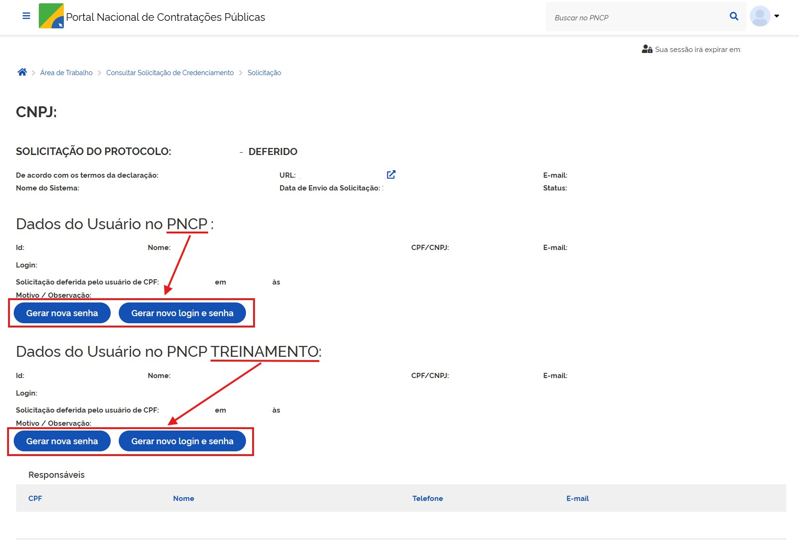

Serviços de Órgão/Entidade
--------------------------

Incluir Órgão
~~~~~~~~~~~~~

Serviço **destinado exclusivamente aos administradores do PNCP** que permite inserir um órgão/entidade que eventualmente não se encontre nos repositórios do PNCP, ou seja, o portal possui uma base de dados com as informações dos Órgãos ou Entes da Federação. No entanto, caso o Órgão ou Ente não esteja incluso nessa base de dados o usuário pode utilizar este serviço com vistas a inclusão. 

**Observação:** Este serviço não pode ser confundido com o serviço 6.1.1., que cadastra a lista de CNPJs dos entes autorizados (órgão) o qual o usuário estar-se-á apto a divulgar informações. 

A partir de 25/08/2023 este serviço está integrado com o sistema CNPJ bastando informar apenas o número de CNPJ do órgão. 
**Observação:** não está disponível para plataformas públicas e privadas a desde 18/08/2025.

Detalhes da Requisição
^^^^^^^^^^^^^^^^^^^^^^

.. list-table::
   :width: 100%
   :widths: 50 15
   :header-rows: 1

   * - Endpoint
     - Método HTTP
   * - /v1/orgaos 
     - POST
	 
Exemplo de Payload
^^^^^^^^^^^^^^^^^^

.. code-block:: json
  :linenos:
  :emphasize-lines: 5,6
	{
		"cnpj": "10000000000003" 
	} 
  
Exemplo Requisição (cURL)
^^^^^^^^^^^^^^^^^^^^^^^^^

.. code-block:: bash

	curl -k -X POST --header "Authorization: Bearer access_token" 
	"${BASE_URL}/v1/orgaos" -H "accept: */*" -H "Content-Type: application/json" 
	--data "@/home/objeto.json" 

Dados de entrada
^^^^^^^^^^^^^^^^

.. list-table::
   :width: 100%
   :widths: 5 25 15 25
   :header-rows: 1

   * - Id
     - Campo
     - Tipo
     - Obrigatório
     - Descrição

   * - 1
     - cnpj
     - Texto (14)
     - Sim
     - CNPJ do órgão

Dados de retorno
^^^^^^^^^^^^^^^^

.. list-table::
   :width: 100%
   :widths: 5 25 15 25
   :header-rows: 1

   * - Id
     - Campo
     - Tipo
     - Obrigatório
     - Descrição

   * - 1
     - location
     - Texto (255)
     - Sim
     - Endereço HTTP do recurso criado

Exemplo de Retorno
^^^^^^^^^^^^^^^^^^

.. code-block:: bash

	Retorno: 
	access-control-allow-credentials: true 
	access-control-allow-headers: Content-Type,Authorization,X-Requested-With,Content-Length,Accept,Origin, 
	access-control-allow-methods: GET,PUT,POST,DELETE,OPTIONS 
	access-control-allow-origin: * 
	cache-control: no-cache,no-store,max-age=0,must-revalidate 
	content-length: 0 
	date: ? 
	expires: 0 
	location: https://treina.pncp.gov.br/api/pncp/v1/orgaos/1 
	pragma: no-cache 
	strict-transport-security: max-age=? 
	x-content-type-options: nosniff 
	x-firefox-spdy: ? 
	x-frame-options: DENY 
	x-xss-protection: 1; mode=block

Códigos de Retorno
^^^^^^^^^^^^^^^^^^

.. list-table::
   :width: 100%
   :widths: 10 25 20
   :header-rows: 1

   * - Código HTTP
     - Mensagem
     - Tipo
   * - 200
     - OK
     - Sucesso
   * - 400
     - BadRequest
     - Erro
   * - 422
     - Unprocessable Entity
     - NotFound
   * - 500
     - Internal Server Error
     - Erro

Atualizar Órgão 
~~~~~~~~~~~~~~~

Serviço **destinado exclusivamente aos administradores do PNCP** que permite atualizar os dados de um órgão/entidade no repositório do PNCP que eventualmente esteja 
desatualizado. 

**Observação:** não está disponível para plataformas privadas a partir desde 18/08/2025.

Detalhes da Requisição
^^^^^^^^^^^^^^^^^^^^^^

.. list-table::
   :width: 100%
   :widths: 50 15
   :header-rows: 1

   * - Endpoint
     - Método HTTP
   * - /v1/orgaos
     - PUT	 

Exemplo de Payload
^^^^^^^^^^^^^^^^^^

.. code-block:: json
  :linenos:
  :emphasize-lines: 5,6
	{ 
		"cnpj": "10000000000003" 
	}  

Exemplo Requisição (cURL)
^^^^^^^^^^^^^^^^^^^^^^^^^

.. code-block:: bash

	curl -k -X PUT --header "Authorization: Bearer access_token" 
	"${BASE_URL}/v1/orgaos" -H "accept: */*" -H "Content-Type: application/json" 
	--data "@/home/objeto.json"

Dados de entrada
^^^^^^^^^^^^^^^^

.. list-table::
   :width: 100%
   :widths: 5 25 15 25
   :header-rows: 1

   * - Id
     - Campo
     - Tipo
     - Obrigatório
     - Descrição

   * - 1
     - cnpj
     - Texto (14)
     - Sim
     - CNPJ do órgão

Dados de retorno
^^^^^^^^^^^^^^^^

.. list-table::
   :width: 100%
   :widths: 5 25 15 25
   :header-rows: 1

   * - Id
     - Campo
     - Tipo
     - Obrigatório
     - Descrição

   * - 1
     - location
     - Texto (255)
     - Sim
     - Endereço HTTP do recurso criado

Códigos de Retorno
^^^^^^^^^^^^^^^^^^

.. list-table::
   :width: 100%
   :widths: 10 25 20
   :header-rows: 1

   * - Código HTTP
     - Mensagem
     - Tipo
   * - 200
     - OK
     - Sucesso
   * - 400
     - BadRequest
     - Erro
   * - 422
     - Unprocessable Entity
     - NotFound
   * - 500
     - Internal Server Error
     - Erro

Consultar Órgão por CNPJ
~~~~~~~~~~~~~~~~~~~~~~~~

Serviço que permite consultar um órgão pelo seu CNPJ.

Detalhes da Requisição
^^^^^^^^^^^^^^^^^^^^^^

.. list-table::
   :width: 100%
   :widths: 50 15
   :header-rows: 1

   * - Endpoint
     - Método HTTP
   * - /v1/orgaos/{cnpj} 
     - GET	 

Exemplo Requisição (cURL)
^^^^^^^^^^^^^^^^^^^^^^^^^

.. code-block:: bash

   curl -k -X GET "${BASE_URL}/v1/orgaos/10000000000003" 
   -H "accept: */*" 

Dados de entrada
^^^^^^^^^^^^^^^^

.. note::
   Informar o parâmetro ``cnpj`` na URL.

.. list-table::
   :width: 100%
   :widths: 5 25 15 25
   :header-rows: 1

   * - Id
     - Campo
     - Tipo
     - Obrigatório
     - Descrição

   * - 1
     - cnpj
     - Texto (14)
     - Sim
     - CNPJ do órgão

Dados de retorno
^^^^^^^^^^^^^^^^

.. list-table::
   :width: 100%
   :widths: 5 25 15 25
   :header-rows: 1

   * - Id
     - Campo
     - Tipo
     - Descrição

   * - 1
     - cnpj
     - Texto (14)
     - CNPJ do órgão
   * - 2
     - razaoSocial
     - Texto (100)
     - Razão social do órgão

Códigos de Retorno
^^^^^^^^^^^^^^^^^^

.. list-table::
   :width: 100%
   :widths: 10 25 20
   :header-rows: 1

   * - Código HTTP
     - Mensagem
     - Tipo
   * - 200
     - OK
     - Sucesso
   * - 400
     - BadRequest
     - Erro
   * - 422
     - Unprocessable Entity
     - NotFound
   * - 500
     - Internal Server Error
     - Erro

Incluir Unidade
~~~~~~~~~~~~~~~

Serviço que permite inserir uma unidade em um órgão/entidade.
As unidades são divisões administrativas que realizam as contratações e celebram os contratos. Todo órgão/entidade deverá ter cadastrado ao menos uma unidade no PNCP.
Para a inclusão de nova unidade, a plataforma deve ter o órgão/entidade habilitado como ente autorizado.

**Exemplo:**
- Órgão: Município de Itapuranga
- Unidade Administrativa: Fundo Municipal de Assistência Social
Para unidades localizadas fora do território brasileiro, foi incluído o código genérico ``9097071`` para ser cadastrado no campo ``codigoIBGE``.
Será retornado nome do município ``Exterior`` e UF ``EX``.

.. warning::

   Disponível apenas no ambiente de treinamento/homologação.
   No ambiente de produção, utilize o procedimento do item 6.2.9 – Gestão de Órgão e Entidade.

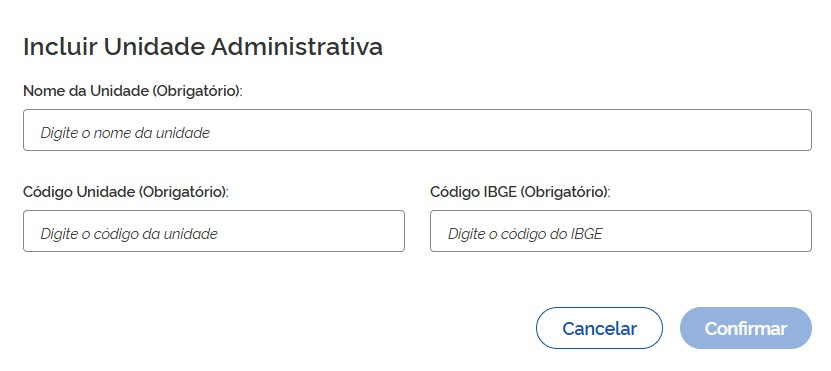

Detalhes da Requisição
^^^^^^^^^^^^^^^^^^^^^^

.. list-table::
   :width: 100%
   :widths: 50 15
   :header-rows: 1

   * - Endpoint
     - Método HTTP
   * - /v1/orgaos/{cnpj}/unidades
     - POST
	 

Exemplo de Payload
^^^^^^^^^^^^^^^^^^

.. code-block:: json
  :linenos:
  :emphasize-lines: 5,6
	{ 
		"codigoIBGE": "1000001", 
		"codigoUnidade": "1", 
		"nomeUnidade": "Unidade administrativa" 
	}
  

Exemplo Requisição (cURL)
^^^^^^^^^^^^^^^^^^^^^^^^^

.. code-block:: bash

   curl -k -X POST --header "Authorization: Bearer access_token" 
   "${BASE_URL}/v1/orgaos/10000000000003/unidades" -H "accept: */*" -H "Content-Type: 
   application/json" --data "@/home/objeto.json"

Dados de entrada
^^^^^^^^^^^^^^^^

.. note::
   A URL possui o parâmetro ``cnpj``.

.. list-table::
   :width: 100%
   :widths: 5 25 15 25
   :header-rows: 1

   * - Id
     - Campo
     - Tipo
     - Obrigatório
     - Descrição

   * - 1
     - cnpj
     - Texto (14)
     - Sim
     - CNPJ do órgão ao qual a unidade será vinculada
   * - 2
     - codigoIBGE
     - Texto (7)
     - Sim
     - Código do município definido pelo IBGE ou utilizar o código ``9097071`` para localidade no exterior
   * - 3
     - codigoUnidade
     - Texto (30)
     - Sim
     - Código da unidade administrativa a ser vinculada (definido pelo próprio órgão)
   * - 4
     - nomeUnidade
     - Texto (100)
     - Sim
     - Nome da unidade administrativa

Dados de retorno
^^^^^^^^^^^^^^^^

.. list-table::
   :width: 100%
   :widths: 5 25 15 25
   :header-rows: 1

   * - Id
     - Campo
     - Tipo
     - Obrigatório
     - Descrição

   * - 1
     - location
     - Texto (255)
     - Sim
     - Endereço HTTP do recurso criado

Exemplo de Retorno
^^^^^^^^^^^^^^^^^^

.. code-block:: bash

	Retorno: 
	access-control-allow-credentials: true 
	access-control-allow-headers: Content-Type,Authorization,X-Requested-With,Content-Length,Accept,Origin, 
	access-control-allow-methods: GET,PUT,POST,DELETE,OPTIONS 
	access-control-allow-origin: * 
	cache-control: no-cache,no-store,max-age=0,must-revalidate 
	content-length: 0 
	date: ? 
	expires: 0 
	location: https://treina.pncp.gov.br/api/pncp/v1/orgaos/10000000000003/unidades/1 
	pragma: no-cache 
	strict-transport-security: max-age=? 
	x-content-type-options: nosniff 
	x-firefox-spdy: ? 
	x-frame-options: DENY 
	x-xss-protection: 1; mode=block

Códigos de Retorno
^^^^^^^^^^^^^^^^^^

.. list-table::
   :width: 100%
   :widths: 10 25 20
   :header-rows: 1

   * - Código HTTP
     - Mensagem
     - Tipo
   * - 200
     - OK
     - Sucesso
   * - 400
     - BadRequest
     - Erro
   * - 422
     - Unprocessable Entity
     - NotFound
   * - 500
     - Internal Server Error
     - Erro

Atualizar Unidade
~~~~~~~~~~~~~~~~~

Serviço que permite atualizar os dados (nome da unidade e código IBGE do município) de uma unidade em um órgão/entidade. 
Incluído no PNCP o código genérico 9097071 a ser usado como codigoIBGE possibilitando inclusão de Unidade localizada no exterior. Será retornado nome do 
município “Exterior” e UF “EX”. 

.. warning::

	Disponível apenas no ambiente de treinamento/homologação. No ambiente de produção, utilize o procedimento do item 6.2.9 – Gestão de Órgão e Entidade. 

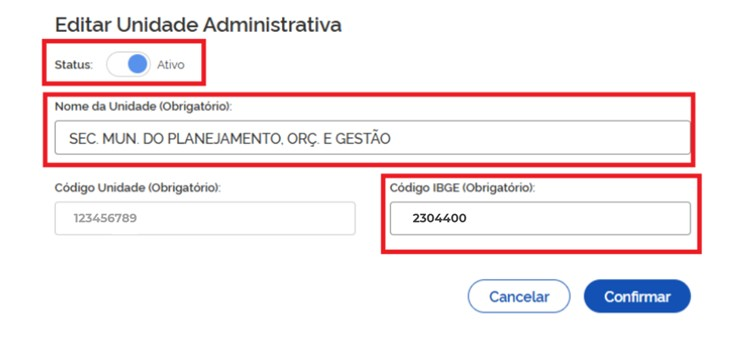

.. warning::
	- Status: Ativar/Inativar 
	- Nome da Unidade: campo alfanumérico de livre escolha; 
	- Código Unidade: campo único para o órgão alfanumérico de livre escolha (não pode ser editado); 
	- Código IBGE: Códigos de Municípios do IBGE composto de 7 dígitos, sendo os dois primeiros referentes ao código da Unidade da Federação. 	`https://www.ibge.gov.br/explica/codigos-dos-municipios.php <https://www.ibge.gov.br/explica/codigos-dos-municipios.php>`_

Detalhes da Requisição
^^^^^^^^^^^^^^^^^^^^^^

.. list-table::
   :width: 100%
   :widths: 50 15
   :header-rows: 1

   * - Endpoint
     - Método HTTP
   * - /v1/orgaos/{cnpj}/unidades
     - PUT	 

Exemplo de Payload
^^^^^^^^^^^^^^^^^^

.. code-block:: json
  :linenos:
  :emphasize-lines: 5,6
  	{ 
  		"codigoUnidade": "1", 
  		"nomeUnidade": "Unidade administrativa", 
  		"codigoIBGE": "1000001" 
	}
  

Exemplo Requisição (cURL)
^^^^^^^^^^^^^^^^^^^^^^^^^

.. code-block:: bash

   curl -k -X PUT --header "Authorization: Bearer access_token" 
	"${BASE_URL}/v1/orgaos/10000000000003 /unidades" -H "accept: */*" -H "Content-Type: 
	application/json" --data "@/home/objeto.json"

Dados de entrada
^^^^^^^^^^^^^^^^

.. note::
   A URL possui o parâmetro ``cnpj``.

.. list-table::
   :width: 100%
   :widths: 5 25 15 25
   :header-rows: 1

   * - Id
     - Campo
     - Tipo
     - Obrigatório
     - Descrição

   * - 1
     - cnpj
     - Texto (14)
     - Sim
     - CNPJ do órgão ao qual a unidade será vinculada
   * - 2
     - codigoUnidade
     - Texto (30)
     - Sim
     - Código da unidade administrativa a ser vinculada (definido pelo próprio órgão). Obs: dado não atualizável
   * - 3
     - nomeUnidade
     - Texto (100)
     - Sim
     - Nome da unidade administrativa
   * - 4
     - codigoIBGE
     - Texto (7)
     - Sim
     - Código do município definido pelo IBGE ou utilizar o código ``9097071`` para localidade no exterior

Dados de retorno
^^^^^^^^^^^^^^^^

.. list-table::
   :width: 100%
   :widths: 5 25 15 25
   :header-rows: 1

   * - Id
     - Campo
     - Tipo
     - Descrição

   * - 1
     - location
     - Texto (255)
     - Endereço HTTP do recurso atualizado

Códigos de Retorno
^^^^^^^^^^^^^^^^^^

.. list-table::
   :width: 100%
   :widths: 10 25 20
   :header-rows: 1

   * - Código HTTP
     - Mensagem
     - Tipo
   * - 200
     - OK
     - Sucesso
   * - 400
     - BadRequest
     - Erro
   * - 422
     - Unprocessable Entity
     - NotFound
   * - 500
     - Internal Server Error
     - Erro

Consultar Unidade
~~~~~~~~~~~~~~~~~

Serviço que permite consultar uma unidade pertencente a um órgão/entidade a partir de seu código. 

Detalhes da Requisição
^^^^^^^^^^^^^^^^^^^^^^

.. list-table::
   :width: 100%
   :widths: 50 15
   :header-rows: 1

   * - Endpoint
     - Método HTTP
   * - /v1/orgaos/{cnpj}/unidades/{codigoUnidade} 
     - GET
	 

Exemplo Requisição (cURL)
^^^^^^^^^^^^^^^^^^^^^^^^^

.. code-block:: bash

	curl -k -X GET 
	"${BASE_URL}/v1/orgaos/10000000000003/unidades/1" -H "accept: */*" 

Dados de Entrada
^^^^^^^^^^^^^^^^

.. note::

   A URL possui os parâmetros ``cnpj`` e ``codigoUnidade``.

.. list-table::
   :width: 100%
   :widths: 5 25 15 10 45
   :header-rows: 1

   * - Id
     - Campo
     - Tipo
     - Obrigatório
     - Descrição
   * - 1
     - cnpj
     - Texto (14)
     - Sim
     - CNPJ do órgão
   * - 2
     - codigoUnidade
     - Texto (30)
     - Sim
     - Código da unidade administrativa responsável pelas contratações

Dados de Retorno
^^^^^^^^^^^^^^^^

.. list-table::
   :width: 100%
   :widths: 5 25 15 55
   :header-rows: 1

   * - Id
     - Campo
     - Tipo
     - Descrição
   * - 1
     - id
     - Inteiro
     - Identificador da Unidade Administrativa
   * - 2
     - orgao
     - 
     - Dados do Órgão ao qual a unidade está vinculada
   * - 2.1
     - id
     - Inteiro
     - Identificador do Órgão
   * - 2.2
     - cnpj
     - Texto (14)
     - CNPJ do Órgão
   * - 2.3
     - razaoSocial
     - Texto (100)
     - Razão Social
   * - 2.4
     - cnpjEnteResponsavel
     - Texto (14)
     - CNPJ do Ente Responsável
   * - 2.5
     - poderId
     - Texto
     - Código do poder a que pertence o Órgão. L - Legislativo; E - Executivo; J - Judiciário
   * - 2.6
     - esferaId
     - Texto
     - Código da esfera a que pertence o Órgão. F - Federal; E - Estadual; M - Municipal; D - Distrital
   * - 2.7
     - hashChaveAcesso
     - Texto
     - Hash da chave de acesso
   * - 2.8
     - validado
     - Booleano
     - Indicador de validação
   * - 2.9
     - dataValidacao
     - Data/Hora
     - Data de validação
   * - 2.10
     - dataInclusao
     - Data/Hora
     - Data de inclusão
   * - 2.11
     - dataAtualizacao
     - Data/Hora
     - Data de atualização
   * - 3
     - codigoUnidade
     - Texto (30)
     - Código da unidade administrativa do órgão/entidade
   * - 4
     - nomeUnidade
     - Texto (100)
     - Nome da unidade administrativa do órgão/entidade
   * - 5
     - municipio
     - 
     - Dados do Município
   * - 5.1
     - id
     - Inteiro
     - Identificador do Município
   * - 5.2
     - uf
     - 
     - Dados da Unidade Federativa
   * - 5.2.1
     - siglaUF
     - Texto (2)
     - Sigla da Unidade Federativa
   * - 5.2.2
     - nomeUF
     - Texto
     - Nome da Unidade Federativa
   * - 5.2.3
     - dataHoraRegistro
     - Data/Hora
     - Data de registro
   * - 5.3
     - nome
     - Texto
     - Nome do Município
   * - 5.4
     - codigoIbge
     - Texto
     - Código IBGE do Município
   * - 5.5
     - dataHoraRegistro
     - Data/Hora
     - Data de registro
   * - 6
     - dataInclusao
     - Data/Hora
     - Data de inclusão do registro
   * - 7
     - dataAtualizacao
     - Data/Hora
     - Data de atualização do registro

Códigos de Retorno
^^^^^^^^^^^^^^^^^^

.. list-table::
   :width: 100%
   :widths: 10 25 20
   :header-rows: 1

   * - Código HTTP
     - Mensagem
     - Tipo
   * - 200
     - OK
     - Sucesso
   * - 400
     - BadRequest
     - Erro
   * - 422
     - Unprocessable Entity
     - NotFound
   * - 500
     - Internal Server Error
     - Erro

Consultar Unidades de um Órgão
~~~~~~~~~~~~~~~~~~~~~~~~~~~~~~

Serviço que permite consultar unidades pertencentes a um órgão/entidade.

Detalhes da Requisição
^^^^^^^^^^^^^^^^^^^^^^

.. list-table::
   :width: 100%
   :widths: 50 15
   :header-rows: 1

   * - Endpoint
     - Método HTTP
   * - /v1/orgaos/{cnpj}/unidades 
     - GET

Exemplo Requisição (cURL)
^^^^^^^^^^^^^^^^^^^^^^^^^

.. code-block:: bash

	curl -k -X GET 
	"${BASE_URL}/v1/orgaos/10000000000003/unidades" -H "accept: */*"

Dados de Entrada
^^^^^^^^^^^^^^^^

.. note::

   A URL possui o parâmetro ``cnpj``.

.. list-table::
   :width: 100%
   :widths: 5 25 15 10 45
   :header-rows: 1

   * - Id
     - Campo
     - Tipo
     - Obrigatório
     - Descrição
   * - 1
     - cnpj
     - Texto (14)
     - Sim
     - CNPJ do órgão contratante

Dados de Retorno
^^^^^^^^^^^^^^^^

.. list-table::
   :width: 100%
   :widths: 5 25 15 55
   :header-rows: 1

   * - Id
     - Campo
     - Tipo
     - Descrição
   * - 1
     - listaUnidades
     - 
     - Agrupador da lista de unidades
   * - 1.1
     - id
     - Inteiro
     - Identificador da Unidade Administrativa
   * - 1.2
     - orgao
     - 
     - Dados do Órgão
   * - 1.2.1
     - id
     - Inteiro
     - Identificador do Órgão
   * - 1.2.2
     - cnpj
     - Texto (14)
     - CNPJ do Órgão
   * - 1.2.3
     - razaoSocial
     - Texto (100)
     - Razão Social
   * - 1.2.4
     - cnpjEnteResponsavel
     - Texto (14)
     - CNPJ do Ente Responsável
   * - 1.2.5
     - poderId
     - Texto
     - Código do poder a que pertence o Órgão. L - Legislativo; E - Executivo; J - Judiciário
   * - 1.2.6
     - esferaId
     - Texto
     - Código da esfera a que pertence o Órgão. F - Federal; E - Estadual; M - Municipal; D - Distrital
   * - 1.2.7
     - hashChaveAcesso
     - Texto
     - Hash da chave de acesso
   * - 1.2.8
     - validado
     - Booleano
     - Indicador de validação
   * - 1.2.9
     - dataValidacao
     - Data/Hora
     - Data de validação
   * - 1.2.10
     - dataInclusao
     - Data/Hora
     - Data de inclusão
   * - 1.2.11
     - dataAtualizacao
     - Data/Hora
     - Data de atualização
   * - 1.3
     - codigoUnidade
     - Texto (30)
     - Código da unidade do órgão/entidade (definido pelo próprio órgão)
   * - 1.4
     - nomeUnidade
     - Texto (100)
     - Nome da unidade do órgão/entidade
   * - 1.5
     - municipio
     - 
     - Dados do Município
   * - 1.5.1
     - id
     - Inteiro
     - Identificador do Município
   * - 1.5.2
     - uf
     - 
     - Dados da Unidade Federativa
   * - 1.5.2.1
     - siglaUF
     - Texto (2)
     - Sigla da Unidade Federativa
   * - 1.5.2.2
     - nomeUF
     - Texto
     - Nome da Unidade Federativa
   * - 1.5.2.3
     - dataHoraRegistro
     - Data/Hora
     - Data de registro
   * - 1.5.3
     - nome
     - Texto
     - Nome do Município
   * - 1.5.4
     - codigoIbge
     - Texto
     - Código IBGE do Município
   * - 1.5.5
     - dataHoraRegistro
     - Data/Hora
     - Data de registro
   * - 1.6
     - dataInclusao
     - Data/Hora
     - Data de inclusão do registro
   * - 1.7
     - dataAtualizacao
     - Data/Hora
     - Data de atualização do registro

Exemplo de Retorno
^^^^^^^^^^^^^^^^^^

.. code-block:: bash

 
Retorno: 
{ 
  "orgao": { 
    "cnpj": "10000000000003", 
    "razaoSocial": "SECRETARIA MUNICIPAL DO BEM ESTAR SOCIAL", 
    "cnpjEnteResponsavel": "", 
    "poderId": "E", 
    "esferaId": "F", 
    "validado": false, 
    "dataValidacao": null 
  }, 
  "codigoUnidade": "1", 
  "nomeUnidade": "Unidade de compra e contrataçoes", 
  "municipio": { 
    "uf": { 
      "siglaUF": "SP", 
      "nomeUF": "São Paulo", 
      "dataHoraRegistro": "2021-05-14T02:24:08.239+00:00" 
    }, 
    "nome": "Município Xpto", 
    "codigoIbge": "0000001", 
    "dataHoraRegistro": "2021-06-17T18:09:18.634+00:00" 
  }, 
  "dataInclusao": "2021-06-24T23:40:44.491+00:00", 
  "dataAtualizacao": "2021-06-24T23:40:44.491+00:00" 
} 

Códigos de Retorno
^^^^^^^^^^^^^^^^^^

.. list-table::
   :width: 100%
   :widths: 10 25 20
   :header-rows: 1

   * - Código HTTP
     - Mensagem
     - Tipo
   * - 200
     - OK
     - Sucesso
   * - 400
     - BadRequest
     - Erro
   * - 422
     - Unprocessable Entity
     - NotFound
   * - 500
     - Internal Server Error
     - Erro

Requerimento Perfil Gestor
~~~~~~~~~~~~~~~~~~~~~~~~~~

A funcionalidade **“Requerimento Perfil Gestor”**, disponível na **Área de Trabalho do PNCP**,  é utilizada para o cadastro do primeiro Gestor do órgão ou entidade no PNCP. 
O acesso à funcionalidade é realizado pelo endereço: `https://pncp.gov.br/app/area-de-trabalho. <https://pncp.gov.br/app/area-de-trabalho>`_  
O responsável pelo órgão acessa o PNCP, realiza a autenticação com login gov.br (nível prata) e preenche o requerimento.
Junto com o requerimento, deverá ser anexado documento comprobatório de sua vinculação ao órgão (portaria de nomeação, por exemplo). Será realizada a validação 
pelo Ministério da Gestão e da Inovação em Serviços Públicos (MGI) e habilitação do gestor. 
Com essa habilitação, o gestor se torna o responsável por fazer a gestão de acesso de outros agentes públicos de seu órgão, autorizar plataformas e gerenciar unidades administrativas.  

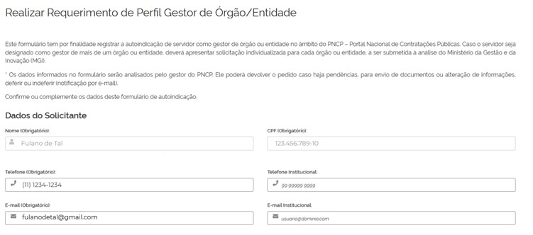

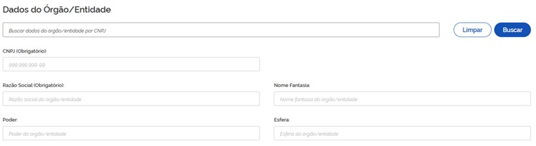

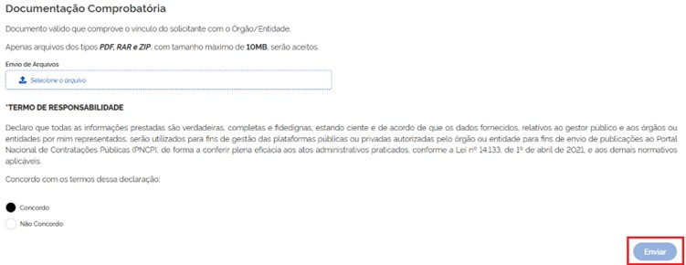

Gestão de Órgão e Entidade 
~~~~~~~~~~~~~~~~~~~~~~~~~~

A funcionalidade “Gestão de Órgão/Entidade”, disponível na Área de Trabalho do PNCP, é utilizada pelo Gestor habilitado para realizar a gestão de acessos, a gestão de plataformas e a gestão de unidades. 
O acesso à funcionalidade se dá pelo endereço: `https://pncp.gov.br/app/area-de-trabalho. <https://pncp.gov.br/app/area-de-trabalho.>`_  
Cabe ao gestor órgão autorizar plataforma publicadora, seja ela pública ou privada, que passe a representar um novo órgão perante o PNCP.

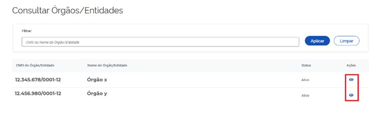

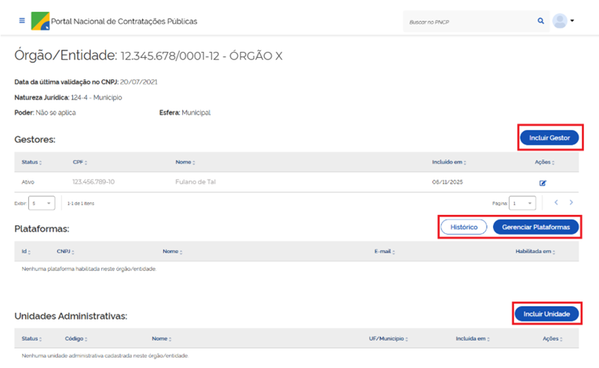

Incluir Gestor de Órgão e Entidade
^^^^^^^^^^^^^^^^^^^^^^^^^^^^^^^^^^

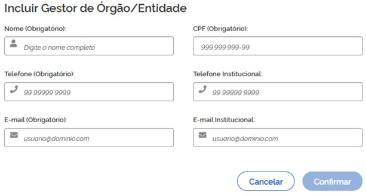

Habilitar/Desabilitar plataforma 
^^^^^^^^^^^^^^^^^^^^^^^^^^^^^^^^

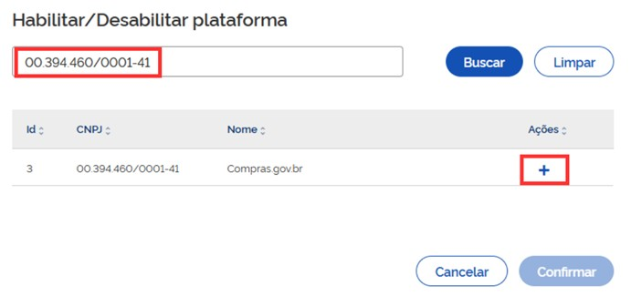

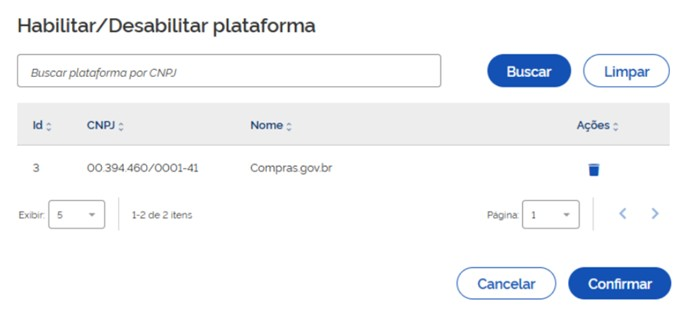

Incluir Unidade Administrativa
^^^^^^^^^^^^^^^^^^^^^^^^^^^^^^

Editar, Ativar/Inativar Unidade Administrativa
^^^^^^^^^^^^^^^^^^^^^^^^^^^^^^^^^^^^^^^^^^^^^^

.. warning::

	- Nome da Unidade: campo alfanumérico de livre escolha;
	- Código Unidade: campo único para o órgão alfanumérico de livre escolha (não é editável);
	- Código IBGE: Códigos de Municípios do IBGE composto de 7 dígitos, sendo os dois primeiros referentes ao código da Unidade da Federação. `https://www.ibge.gov.br/explica/codigos-dos-municipios.php. <https://www.ibge.gov.br/explica/codigos-dos-municipios.php>`_
