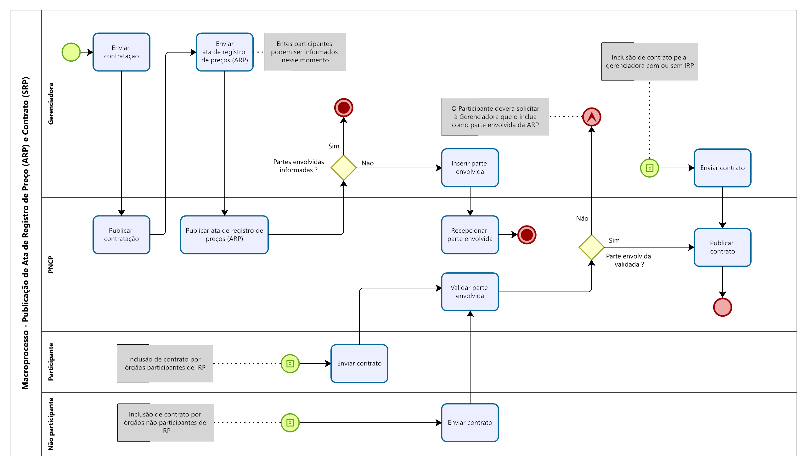
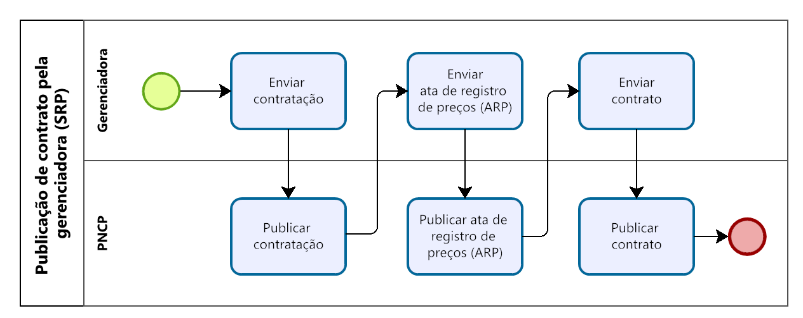
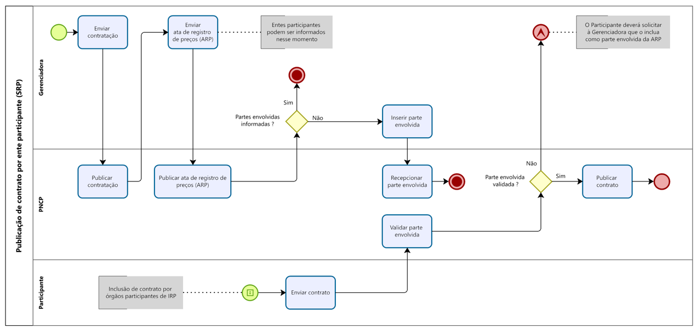
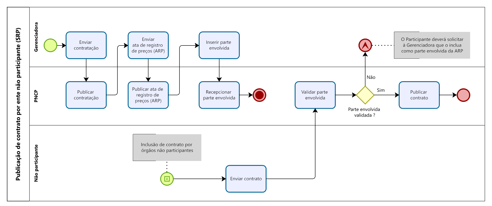

Serviços de Contrato ou Empenho
============================

Inserir Contratos ou Empenhos
~~~~~~~~~~~~~~~~~~~~~~~~~~~~~

Serviço que permite incluir um contrato ou empenho. Este serviço será acionado por qualquer plataforma digital credenciada. 

.. container:: destaque-amarelo
    O sistema exige o upload de um arquivo anexo à ata de registro de preço enviada. As extensões permitidas para o arquivo anexo são listadas na seção Tabelas de domínio - Envio de arquivos pelas APIs de Documento e os tipos de documento/arquivo aceitos pelo PNCP podem ser consultados na seção Tabelas de domínio - Tipo de Documento, deste manual.

\

.. Attention::
  
    Conforme regra de conformidade, prevista no item 5.19, não é possível a inclusão ou retificação de contrato ou empenho que pertença à contratação realizada por Sistema de Registro de Preços (SRP), a qual não possua ao menos uma ata de registro de preços publicada no PNCP. 

**Atualizações da versão 2.3.10**
^^^^^^^^^^^^^^^^^^^^^^^^^^^^^^^^^

.. versionadded:: 2.3.10
 
.. list-table::
  :widths: auto
  :header-rows: 1

  * - Id
    - Campo
    - Tipo
    - Obrigatório
    - Descrição
  * - 27
    - dataVigenciaFim
    - Data
    - Não
    - Data do término da vigência do contrato. Opcional apenas para contrato do tipo igual a 1.
  * - :kbd:`30`
    - :kbd:`sequencialAta`
    - :kbd:`Inteiro`
    - :kbd:`Não`
    - :kbd:`Número sequencial da ata de registro de preço (gerado pelo PNCP no momento da inclusão da ata).`
  * - :kbd:`31`
    - :kbd:`frutoAdesao`
    - :kbd:`Booleano`
    - :kbd:`Sim`
    - :kbd:`Indicador se o contrato/empenho é de um não participante, ou seja, fruto da adesão a uma ata de registro de preço.`

.. versionchanged:: 2.3.10

  não houve alterações.

.. deprecated:: 2.3.10

  não houve alterações.

Detalhes da Requisição
^^^^^^^^^^^^^^^^^^^^^^

.. list-table::
   :width: 100%
   :widths: 50 15
   :header-rows: 1

   * - Endpoint
     - Método HTTP
   * - /v1/orgaos/{cnpj}/contratos
     - POST

Exemplo de Payload
^^^^^^^^^^^^^^^^^^

.. code-block:: json
  :linenos:
  :emphasize-lines: 1,6-8

    Arquivo JSON:
      {
      "cnpjCompra": "10000000000003",
      "anoCompra": 2021,
      "sequencialCompra": 1,
      "sequencialAta": 1,
      "frutoAdesao": true,
      "temRemanejamento": false,
      "tipoContratoId": 1,
      "numeroContratoEmpenho": "1",
      "anoContrato": 2021,
      "processo": "1/2021",
      "categoriaProcessoId": 2,
      "receita": false,
      "codigoUnidade": "1",
      "niFornecedor": "10000000000010",
      "tipoPessoaFornecedor": "PJ",
      "nomeRazaoSocialFornecedor": "Fornecedor do Teste I",
      "objetoContrato": "Contrato para exemplificar uso da API PNCP",
      "informacaoComplementar": "",
      "valorInicial": 10000.0000,
      "numeroParcelas": 2,
      "valorParcela": 5000.0000,
      "valorGlobal": 10000.0000,
      "valorAcumulado": 10000.0000,
      "dataAssinatura": "2021-07-27",
      "dataVigenciaInicio": "2021-07-28",
      "dataVigenciaFim": "2021-07-29",
      "identificadorCipi": "111.11-011",
      "urlCipi": "https://cipi.economia.gov.br/111.11-011"
    }

Exemplo Requisição (cURL)
^^^^^^^^^^^^^^^^^^^^^^^^^

.. code-block:: bash
  :linenos:
  :emphasize-lines: 1-6

   curl -X POST \
     --header "Authorization: Bearer access_token" \
     --header "accept: */*" \
     --header "Content-Type: application/json" \
     --data "@home/objeto.json" \
     "$BASE_URL/v1/orgaos/100000000000003/contratos"

Dados de entrada
^^^^^^^^^^^^^^^^

.. note::
   Alimentar o parâmetro {cnpj} na URL.

.. list-table::
   :width: 100%
   :widths: 5 25 15 25
   :header-rows: 1

   * - Id
     - Campo
     - Tipo
     - Obrigatório
     - Descrição
   * - 1
     - cnpj
     - Texto (14)
     - Sim
     - CNPJ do órgão do contrato/empenho
   * - 2
     - tituloDocumento
     - Texto (255)
     - Sim
     - Título do documento
   * - 3
     - tipoDocumentoId
     - Inteiro
     - Sim
     - Código da tabela de domínio tipo de documento
   * - 4
     - cnpjCompra
     - Texto (14)
     - Sim
     - CNPJ do órgão originário da contratação (proprietário da contratação ou alienação de bens)
   * - 5
     - anoCompra
     - Inteiro
     - Sim
     - Ano da contratação
   * - 6
     - sequencialCompra
     - Inteiro
     - Sim
     - Número sequencial da contratação (gerado pelo PNCP no momento da inclusão da contratação)
   * - 7
     - tipoContratoId
     - Inteiro
     - Sim
     - Código da tabela de domínio tipo de contrato/empenho
   * - 8
     - numeroContratoEmpenho
     - Texto (50)
     - Sim
     - Número do contrato ou empenho com força de contrato no sistema de origem
   * - 9
     - anoContrato
     - Inteiro
     - Sim
     - Ano do contrato/empenho
   * - 10
     - processo
     - Texto (50)
     - Sim
     - Número do processo
   * - 11
     - categoriaProcessoId
     - Inteiro
     - Sim
     - Código da tabela de domínio categoria
   * - 12
     - receita
     - Booleano
     - Sim
     - Receita ou despesa (true = receita / false = despesa)
   * - 13
     - codigoUnidade
     - Texto (20)
     - Sim
     - Código da unidade executora do órgão do contrato/empenho; a unidade deverá estar cadastrada para o órgão
   * - 14
     - niFornecedor
     - Texto (30)
     - Sim
     - Número de identificação do fornecedor/arrematante (CNPJ, CPF ou identificador de empresa estrangeira)
   * - 15
     - tipoPessoaFornecedor
     - Texto (2)
     - Sim
     - PJ - pessoa jurídica; PF - pessoa física; PE - pessoa estrangeira
   * - 16
     - nomeRazaoSocialFornecedor
     - Texto (100)
     - Sim
     - Nome ou razão social do fornecedor/arrematante
   * - 17
     - niFornecedorSubContratado
     - Texto (30)
     - Não
     - Número de identificação do fornecedor subcontratado (somente em caso de subcontratação; não se aplica a leilão)
   * - 18
     - tipoPessoaFornecedorSubContratado
     - Texto (2)
     - Não
     - Tipo de pessoa do fornecedor subcontratado (somente em caso de subcontratação; não se aplica a leilão)
   * - 19
     - nomeRazaoSocialFornecedorSubContratado
     - Texto (100)
     - Não
     - Nome ou razão social do fornecedor subcontratado (somente em caso de subcontratação; não se aplica a leilão)
   * - 20
     - objetoContrato
     - Texto (5120)
     - Sim
     - Descrição do objeto do contrato/empenho
   * - 21
     - informacaoComplementar
     - Texto (5120)
     - Não
     - Informações complementares, se existirem
   * - 22
     - valorInicial
     - Decimal
     - Sim
     - Valor inicial do contrato/empenho (precisão de 4 dígitos decimais; ex: 100.0000)
   * - 23
     - numeroParcelas
     - Inteiro
     - Sim
     - Número de parcelas
   * - 24
     - valorParcela
     - Decimal
     - Não
     - Valor da parcela (precisão de 4 dígitos decimais; ex: 100.0000)
   * - 25
     - valorGlobal
     - Decimal
     - Sim
     - Valor global do contrato/empenho (precisão de 4 dígitos decimais; ex: 100.0000)
   * - 26
     - valorAcumulado
     - Decimal
     - Não
     - Valor acumulado do contrato/empenho (precisão de 4 dígitos decimais; ex: 100.0000)
   * - 27
     - dataAssinatura
     - Data
     - Sim
     - Data de assinatura do contrato
   * - 28
     - dataVigenciaInicio
     - Data
     - Sim
     - Data de início de vigência do contrato
   * - 29
     - dataVigenciaFim
     - Data
     - Não
     - Data de término da vigência do contrato (opcional apenas para contrato do tipo igual a 1)
   * - 30
     - identificadorCipi
     - String (512)
     - Não
     - Identificador do contrato no Cadastro Integrado de Projetos de Investimento (não se aplica a leilão)
   * - 31
     - urlCipi
     - String (8 a 14)
     - Não
     - URL com informações do contrato no sistema de Cadastro Integrado de Projetos de Investimento (não se aplica a leilão)
   * - :kbd:`32`
     - :kbd:`sequencialAta`
     - :kbd:`Inteiro`
     - :kbd:`Não`
     - :kbd:`Número sequencial da ata de registro de preço (gerado pelo PNCP no momento da inclusão da ata)`
   * - :kbd:`33`
     - :kbd:`frutoAdesao`
     - :kbd:`Booleano`
     - :kbd:`Sim`
     - :kbd:`Indicador se o contrato/empenho é fruto de adesão a ata de registro de preço (false = não / true = sim)`
   * - :kbd:`34`
     - :kbd:`temRemanejamento`
     - :kbd:`Booleano`
     - :kbd:`Sim`
     - :kbd:`Indicador de remanejamento (false = não / true = sim)`

Dados de retorno
^^^^^^^^^^^^^^^^

.. list-table::
   :width: 100%
   :widths: 5 25 15 10 25
   :header-rows: 1

   * - Id
     - Campo
     - Tipo
     - Obrigatório
     - Descrição
   * - 1
     - location
     - Texto (255) 
     - Sim
     - Endereço http do recurso criado

Exemplo de Retorno
^^^^^^^^^^^^^^^^^^

.. code-block:: http
   :linenos:

   HTTP/1.1 201 Created
   access-control-allow-credentials: true
   access-control-allow-headers: Content-Type,Authorization,X-Requested-With,Content-Length,Accept,Origin
   access-control-allow-methods: GET,PUT,POST,DELETE,OPTIONS
   access-control-allow-origin: *
   cache-control: no-cache,no-store,max-age=0,must-revalidate
   content-length: 0
   date: Tue, 21 Jul 2021 10:00:00 GMT
   expires: 0
   location: https://treina.pncp.gov.br/api/pncp/v1/orgaos/10000000000003/contratos/2021/1
   pragma: no-cache
   strict-transport-security: max-age=31536000
   x-content-type-options: nosniff
   x-frame-options: DENY
   x-xss-protection: 1; mode=block

**Códigos de Retorno**
^^^^^^^^^^^^^^^^^^^^^^

.. list-table::
   :width: 100%
   :widths: 10 25 25
   :header-rows: 1

   * - Código HTTP
     - Mensagem
     - Tipo
   * - 201
     - Created
     - Sucesso
   * - 400
     - BadRequest
     - Erro
   * - 422
     - Unprocessable Entity
     - Erro
   * - 500
     - Internal Server Error
     - Erro

Retificar Contrato ou Empenho
~~~~~~~~~~~~~~~~~~~~~~~~~~~~~

Serviço que permite retificar um contrato ou empenho. Este serviço será acionado por
qualquer plataforma digital credenciada. 

.. Attention::
  
  Na Retificação todas as informações terão que ser enviadas novamente, não apenas as que sofreram alteração. Conforme regra de conformidade, prevista no item 5.19, não é possível a inclusão ou retificação de contrato ou empenho que pertença à contratação realizada por Sistema de Registro de Preços (SRP), a qual não possua ao menos uma ata de registro de preços publicada no PNCP.

**Atualizações da versão 2.3.10**
^^^^^^^^^^^^^^^^^^^^^^^^^^^^^^^^^

.. versionadded:: 2.3.10
 
.. list-table::
  :widths: auto
  :header-rows: 1

  * - Id
    - Campo
    - Tipo
    - Obrigatório
    - Descrição
  * - 30
    - dataVigenciaFim
    - Data
    - Não
    - Data do término da vigência do contrato. Opcional apenas para contrato do tipo igual a 1.
  * - 34
    - sequencialAta
    - Inteiro
    - Não
    - Número sequencial da ata de registro de preço (gerado pelo PNCP no momento da inclusão da ata).
  * - 35
    - frutoAdesao
    - Booleano
    - Sim
    - Indicador se o contrato/empenho é de um não participante, ou seja, fruto da adesão a uma ata de registro de preço.

.. versionchanged:: 2.3.10

  não houve alterações.

.. deprecated:: 2.3.10

  não houve alterações.

Detalhes da Requisição
^^^^^^^^^^^^^^^^^^^^^^

.. list-table::
   :width: 100%
   :widths: 50 15
   :header-rows: 1

   * - Endpoint
     - Método HTTP
   * - /v1/orgaos/{cnpj}/contratos/{ano}/{sequencial}
     - PUT

Exemplo de Payload
^^^^^^^^^^^^^^^^^^

.. code-block:: json
   :linenos:
   :emphasize-lines: 5-7

       {
      "cnpjCompra": "10000000000003",
      "anoCompra": 2021,
      "sequencialCompra": 1,
      "sequencialAta": 1,
      "frutoAdesao": true,
      "temRemanejamento": false,
      "tipoContratoId": 1,
      "numeroContratoEmpenho": "1",
      "processo": "1/2021",
      "categoriaProcessoId": 2,
      "receita": false,
      "codigoUnidade": "1",
      "cnpjOrgaoSubRogado": "",
      "codigoUnidadeSubRogada": "",
      "niFornecedor": "10000000000010",
      "tipoPessoaFornecedor": "PJ",
      "nomeRazaoSocialFornecedor": "Fornecedor do Teste I",
      "niFornecedorSubContratado": "",
      "tipoPessoaFornecedorSubContratado": "",
      "nomeRazaoSocialFornecedorSubContratado": "",
      "objetoContrato": "Contrato para exemplificar uso da API de retificação no PNCP.",
      "informacaoComplementar": "",
      "valorInicial": 10000.00,
      "numeroParcelas": 2,
      "valorParcela": 5000.00,
      "valorGlobal": 10000.00,
      "valorAcumulado": 10000.00,
      "dataAssinatura": "2021-07-21",
      "dataVigenciaInicio": "2021-07-22",
      "dataVigenciaFim": "2021-07-23",
      "justificativa": "motivo/justificativa para a retificação do contrato"
      “identificadorCipi”: “111.11-011”,
      “urlCipi”: ” https://cipi.economia.gov.br/111.11-011”
    }

Exemplo Requisição (cURL)
^^^^^^^^^^^^^^^^^^^^^^^^^

.. code-block:: bash
  :linenos:

   curl -k -X PUT \
     --header "Authorization: Bearer access_token" \
     -H "accept: */*" \
     -H "Content-Type: application/json" \
     "${BASE_URL}/v1/orgaos/10000000000003/contratos/2021/1" \
     --data "@/home/objeto.json"

Dados de Entrada
^^^^^^^^^^^^^^^^

.. note::

  Alimentar os parâmetros {cnpj}, {ano} e {sequencial} na URL.

.. list-table::
   :width: 100%
   :widths: 5 25 15 10 25
   :header-rows: 1

   * - Id
     - Campo
     - Tipo
     - Obrigatório
     - Descrição
   * - 1
     - cnpj
     - Texto (14)
     - Sim
     - Cnpj do órgão do contrato/empenho
   * - 2
     - ano
     - Inteiro
     - Sim
     - Ano do contrato/empenho
   * - 3
     - sequencial
     - Inteiro
     - Sim
     - Número sequencial do contrato/empenho (gerado pelo PNCP no momento da inclusão do mesmo)
   * - 4
     - cnpjCompra
     - Texto (14)
     - Sim
     - Cnpj do órgão originário da contratação (proprietário da contratação ou alienação de bens)
   * - 5
     - anoCompra
     - Inteiro
     - Sim
     - Ano da contratação
   * - 6
     - sequencialCompra
     - Inteiro
     - Sim
     - Número sequencial da contratação (gerado pelo PNCP no momento da inclusão da contratação)
   * - 7
     - tipoContratoId
     - Inteiro
     - Sim
     - Código da tabela de domínio Tipo de contrato
   * - 8
     - numeroContratoEmpenho
     - Texto (50)
     - Sim
     - Número do contrato ou empenho com força de contrato
   * - 9
     - processo
     - Texto (50)
     - Sim
     - Número do processo
   * - 10
     - categoriaProcessoId
     - Inteiro
     - Sim
     - Código da tabela de domínio Categoria
   * - 11
     - receita
     - Booleano
     - Sim
     - Receita ou despesa: True - Receita; False - Despesa
   * - 12
     - codigoUnidade
     - Texto (20)
     - Sim
     - Código da unidade executora do órgão do contrato/empenho; a unidade deverá estar cadastrada para o órgão
   * - 13
     - cnpjOrgaoSubRogado
     - Texto (14)
     - Não
     - Cnpj do órgão sub-rogado; somente em caso de sub-rogação
   * - 14
     - codigoUnidadeSubRogada
     - Texto (20)
     - Não
     - Código da unidade executora do órgão sub-rogado do contrato/empenho. Obrigatório caso ocorra sub-rogação do órgão
   * - 15
     - niFornecedor
     - Texto (30)
     - Sim
     - Número de identificação do fornecedor/arrematante; CNPJ, CPF ou identificador de empresa estrangeira
   * - 16
     - tipoPessoaFornecedor
     - Texto (2)
     - Sim
     - PJ - Pessoa jurídica; PF - Pessoa física; PE - Pessoa estrangeira
   * - 17
     - nomeRazaoSocialFornecedor
     - Texto (100)
     - Sim
     - Nome ou razão social do fornecedor/arrematante
   * - 18
     - niFornecedorSubContratado
     - Texto (30)
     - Não
     - Número de identificação do fornecedor subcontratado; CNPJ, CPF ou identificador de empresa estrangeira; somente em caso de subcontratação; não se aplica a leilão
   * - 19
     - tipoPessoaFornecedorSubContratado
     - Texto (2)
     - Não
     - PJ - Pessoa jurídica; PF - Pessoa física; PE - Pessoa estrangeira; somente em caso de subcontratação; não se aplica a leilão
   * - 20
     - nomeRazaoSocialFornecedorSubContratado
     - Texto (100)
     - Não
     - Nome ou razão social do fornecedor subcontratado; somente em caso de subcontratação; não se aplica a leilão
   * - 21
     - objetoContrato
     - Texto (5120)
     - Sim
     - Descrição do objeto do contrato/empenho
   * - 22
     - informacaoComplementar
     - Texto (5120)
     - Não
     - Informações complementares, se existirem
   * - 23
     - valorInicial
     - Decimal
     - Sim
     - Valor inicial do contrato/empenho; precisão de 4 dígitos decimais. Ex: 100.0000
   * - 24
     - numeroParcelas
     - Inteiro
     - Sim
     - Número de parcelas
   * - 25
     - valorParcela
     - Decimal
     - Não
     - Valor da parcela; precisão de 4 dígitos decimais. Ex: 100.0000
   * - 26
     - valorGlobal
     - Decimal
     - Sim
     - Valor global do contrato/empenho; precisão de 4 dígitos decimais. Ex: 100.0000
   * - 27
     - valorAcumulado
     - Decimal
     - Não
     - Valor acumulado do contrato/empenho; precisão de 4 dígitos decimais. Ex: 100.0000
   * - 28
     - dataAssinatura
     - Data
     - Sim
     - Data de assinatura do contrato
   * - 29
     - dataVigenciaInicio
     - Data
     - Sim
     - Data de início de vigência do contrato
   * - 30
     - dataVigenciaFim
     - Data
     - :kbd:`Não`
     - :kbd:`Data do término da vigência do contrato. Opcional apenas para contrato do tipo igual a 1`
   * - 31
     - justificativa
     - Texto (255)
     - Sim
     - Motivo/justificativa para a retificação dos atributos do contrato/empenho
   * - 32
     - identificadorCipi
     - String (512)
     - Não
     - Identificador do contrato no Cadastro Integrado de Projetos de Investimento. Não se aplica a leilão
   * - 33
     - urlCipi
     - String (8 a 14)
     - Não
     - Url com informações do contrato no sistema de Cadastro Integrado de Projetos de Investimento. Não se aplica a leilão
   * - :kbd:`34`
     - :kbd:`sequencialAta`
     - :kbd:`Inteiro`
     - :kbd:`Não`
     - :kbd:`Número sequencial da ata de registro de preço (gerado pelo PNCP no momento da inclusão da ata)`
   * - :kbd:`35`
     - :kbd:`frutoAdesao`
     - :kbd:`Booleano`
     - :kbd:`Sim`
     - :kbd:`Indicador se o contrato/empenho é de um não participante, ou seja, fruto da adesão a uma ata de registro de preço (False-Não / True-Sim)`
   * - :kbd:`36`
     - :kbd:`temRemanejamento`
     - :kbd:`Boleano`
     - :kbd:`Sim`
     - :kbd:`Indicador de Remanejamento (False-Não / True-Sim)`

Dados de retorno
^^^^^^^^^^^^^^^^

.. list-table::
   :width: 100%
   :widths: 5 25 15 10 25
   :header-rows: 1

   * - Id
     - Campo
     - Tipo
     - Obrigatório
     - Descrição
   * - 1
     - location
     - Texto (255) 
     - Sim
     - Endereço http do recurso criado

Exemplo de retorno
^^^^^^^^^^^^^^^^^^

.. code-block:: http
   :linenos:

   HTTP/1.1 204 No Content
   Access-Control-Allow-Credentials: true
   Access-Control-Allow-Headers: Content-Type, Authorization, X-Requested-With, Content-Length, Accept, Origin
   Access-Control-Allow-Methods: GET, PUT, POST, DELETE, OPTIONS
   Access-Control-Allow-Origin: *
   Cache-Control: no-cache, no-store, max-age=0, must-revalidate
   Content-Length: 0
   Date: ?
   Expires: 0
   Location: https://treina.pncp.gov.br/api/pncp/v1/orgaos/10000000000003/contratos/2021/1
   Pragma: no-cache
   Strict-Transport-Security: max-age=?
   X-Content-Type-Options: nosniff
   X-Frame-Options: DENY
   X-XSS-Protection: 1; mode=block

**Códigos de Retorno**
^^^^^^^^^^^^^^^^^^^^^^

.. list-table::
   :width: 100%
   :widths: 10 25 25
   :header-rows: 1

   * - Código HTTP
     - Mensagem
     - Tipo
   * - 201
     - Created
     - Sucesso
   * - 400
     - BadRequest
     - Erro
   * - 422
     - Unprocessable Entity
     - Erro
   * - 500

Excluir Contrato ou Empenho
~~~~~~~~~~~~~~~~~~~~~~~~~~~

Serviço que permite remover um contrato ou empenho. Este serviço será acionado por
qualquer plataforma digital credenciada

.. Attention::
  
   Não será possível excluir o Contrato com Termo ativo.

Detalhes da Requisição
^^^^^^^^^^^^^^^^^^^^^^

.. list-table::
   :width: 100%
   :widths: 50 15
   :header-rows: 1

   * - Endpoint
     - Método HTTP
   * - /v1/orgaos/{cnpj}/contratos/{ano}/{sequencial}
     - DELETE

Exemplo de Payload
^^^^^^^^^^^^^^^^^^

.. code-block:: json
  :linenos:

   {
      "justificativa": "motivo/justificativa para exclusão do contrato ou empenho"
   }

Exemplo Requisição (cURL)
^^^^^^^^^^^^^^^^^^^^^^^^^

.. code-block:: bash
  :linenos:  

   curl -k -X DELETE \
   --header "Authorization: Bearer access_token" \
   -H "accept: */*" \
   "${BASE_URL}/v1/orgaos/10000000000003/contratos/2021/1"

Dados de Entrada
^^^^^^^^^^^^^^^^

.. note::

  Alimentar os parâmetros {cnpj}, {ano} e {sequencial} na URL. 

.. list-table::
   :width: 100%
   :widths: 5 25 15 10 25
   :header-rows: 1

   * - Id
     - Campo
     - Tipo
     - Obrigatório
     - Descrição
   * - 1
     - CNPJ
     - Texto (14)
     - Sim
     - Cnpj do órgão do contrato ou empenho 
   * - 2
     - ano
     - Inteiro
     - Sim
     - Ano do contrato ou empenho 
   * - 3
     - sequencial
     - Inteiro
     - Sim
     - Número sequencial do contrato ou empenho (gerado pelo PNCP no momento da inclusão do mesmo) 
   * - 4
     - justificativa
     - Texto (255) 
     - Sim
     - Motivo/justificativa para exclusão do contrato ou empenho.

**Códigos de Retorno**
^^^^^^^^^^^^^^^^^^^^^^

.. list-table::
   :width: 100%
   :widths: 10 25 25
   :header-rows: 1

   * - Código HTTP
     - Mensagem
     - Tipo
   * - 200
     - OK
     - Sucesso
   * - 400
     - BadRequest
     - Erro
   * - 422
     - Unprocessable Entity
     - Erro
   * - 500
     - Internal Server Error
     - Erro
   

Inserir Documento a um Contrato ou Empenho
~~~~~~~~~~~~~~~~~~~~~~~~~~~~~~~~~~~~~~~~~~

Serviço que permite inserir um documento/arquivo a um contrato/empenho. O sistema
permite o upload de arquivos com as extensões listadas na seção: Tabelas de domínio -
Extensões de arquivos aceitos pelas APIs de Documento.

Detalhes da Requisição
^^^^^^^^^^^^^^^^^^^^^^

.. list-table::
   :width: 100%
   :widths: 50 15
   :header-rows: 1

   * - Endpoint
     - Método HTTP
   * - /v1/orgaos/{cnpj}/contratos/{ano}/{sequencial}/arquivos
     - POST

Exemplo de Payload
^^^^^^^^^^^^^^^^^^

Não se aplica.

Exemplo Requisição (cURL)
^^^^^^^^^^^^^^^^^^^^^^^^^^

.. code-block:: bash
  :linenos:

   curl -k -X POST \
     --header "Authorization: Bearer access_token" \
     -H "accept: */*" \
     -H "Content-Type: multipart/form-data" \
     -H "Titulo-Documento: Contrato-2021-1" \
     -H "Tipo-Documento-Id: 12" \
     "${BASE_URL}/v1/orgaos/10000000000003/contratos/2021/1/arquivos" \
     -F "arquivo=@Contrato-2021-1.pdf;type=application/pdf"

Dados de Entrada
^^^^^^^^^^^^^^^^

.. list-table::
   :width: 100%
   :widths: 5 25 15 10 25
   :header-rows: 1

   * - Id
     - Campo
     - Tipo
     - Obrigatório
     - Descrição
   * - 1
     - CNPJ
     - Texto (14)
     - Sim
     - Cnpj do órgão do contrato ou empenho
   * - 2
     - ano
     - Inteiro
     - Sim
     - Ano do contrato ou empenho
   * - 3
     - sequencial
     - Inteiro
     - Sim
     - Sequencial do contrato ou empenhono PNCP; Número sequencialgerado no momento que o contratofoi inserido no PNCP;
   * - 4
     - Titulo-Documento
     - Texto (50)
     - Sim
     - Título do documento
   * - 5
     - Tipo-Documento-Id
     - Inteiro
     - Sim
     - Código da tabela de domínio Tipo de documento

Dados de retorno
^^^^^^^^^^^^^^^^

.. list-table::
   :width: 100%
   :widths: 5 25 15 10 25
   :header-rows: 1

   * - Id
     - Campo
     - Tipo
     - Obrigatório
     - Descrição
   * - 1
     - location
     - Texto (255) 
     - Sim
     - Endereço http do recurso criado

Exemplo de Retorno
^^^^^^^^^^^^^^^^^^

.. code-block:: http
  :linenos:

   Retorno:
   access-control-allow-credentials: true
   access-control-allow-headers: Content-Type, Authorization, X-Requested-With, Content-Length, Accept, Origin
   access-control-allow-methods: GET, PUT, POST, DELETE, OPTIONS
   access-control-allow-origin: *
   cache-control: no-cache, no-store, max-age=0, must-revalidate
   content-length: 0
   date: ?
   expires: 0
   location: https://treina.pncp.gov.br/api/pncp/v1/orgaos/10000000000003/contratos/2021/1/arquivos/1
   nome-bucket: ?
   pragma: no-cache
   strict-transport-security: max-age=?
   x-content-type-options: nosniff
   x-firefox-spdy: ?
   x-frame-options: DENY
   x-xss-protection: 1; mode=block

**Códigos de Retorno**
^^^^^^^^^^^^^^^^^^^^^^

.. list-table::
   :width: 100%
   :widths: 10 25 25
   :header-rows: 1

   * - Código HTTP
     - Mensagem
     - Tipo
   * - 201
     - Created
     - Sucesso
   * - 400
     - BadRequest
     - Erro
   * - 422
     - Unprocessable Entity
     - Erro
   * - 500
     - Internal Server Error
     - Erro

Excluir Documento do Contrato ou Empenho
~~~~~~~~~~~~~~~~~~~~~~~~~~~~~~~~~~~~~~~~

Serviço que permite remover um documento pertencente a um contrato ou empenho
específico.

Detalhes da Requisição
^^^^^^^^^^^^^^^^^^^^^^

.. list-table::
   :width: 100%
   :widths: 50 15
   :header-rows: 1

   * - Endpoint
     - Método HTTP
   * - /v1/orgaos/{cnpj}/contratos/{ano}/{sequencial}/arquivos/{sequencialDocumento}
     - DELETE

Exemplo de Payload
^^^^^^^^^^^^^^^^^^

.. code-block:: json
  :linenos:
  
  {
   "justificativa": "motivo/justificativa paraexclusão do documento do contrato ou empenho"
  }

Exemplo Requisição (cURL)
^^^^^^^^^^^^^^^^^^^^^^^^^^

.. code-block:: bash
  :linenos:

   curl -k -X DELETE \
     --header "Authorization: Bearer access_token" \
     -H "accept: */*" \
     "${BASE_URL}/v1/orgaos/10000000000003/contratos/2021/1/arquivos/1"

Dados de Entrada
^^^^^^^^^^^^^^^^

.. note::

  Alimentar os parâmetros {cnpj}, {ano}, {sequencial} e {sequencialDocumento} na URL. 

.. list-table::
   :width: 100%
   :widths: 5 25 15 10 25
   :header-rows: 1

   * - Id
     - Campo
     - Tipo
     - Obrigatório
     - Descrição
   * - 1
     - CNPJ
     - Texto (14)
     - Sim
     - Cnpj do órgão do contrato ou empenho
   * - 2
     - ano
     - Inteiro
     - Sim
     - Ano do contrato ou empenho 
   * - 3
     - sequencial
     - Inteiro
     - Sim
     - Número sequencial docontrato ou empenho (gerado peloPNCP) 
   * - 4
     - sequencialDocumento
     - Inteiro
     - Sim
     - Número sequencial do documentodo contrato ou empenho (gerado peloPNCP) 
   * - 5
     - justificativa
     - Texto (255)
     - Sim
     - Motivo/justificativa para exclusão do documento do contrato ou empenho.

**Códigos de Retorno**
^^^^^^^^^^^^^^^^^^^^^^

.. list-table::
   :width: 100%
   :widths: 10 25 25
   :header-rows: 1

   * - Código HTTP
     - Mensagem
     - Tipo
   * - 201
     - Created
     - Sucesso
   * - 400
     - BadRequest
     - Erro
   * - 422
     - Unprocessable Entity
     - Erro
   * - 500
     - Internal Server Error
     - Erro

Consultar Todos os Documentos de um Contrato ou Empenho
~~~~~~~~~~~~~~~~~~~~~~~~~~~~~~~~~~~~~~~~~~~~~~~~~~~~~~~

Serviço que permite consultar a lista de documentos pertencentes a um
contrato ou empenho específico.

Detalhes da Requisição
^^^^^^^^^^^^^^^^^^^^^^

.. list-table::
   :width: 100%
   :widths: 50 15
   :header-rows: 1

   * - Endpoint
     - Método HTTP
   * - /v1/orgaos/{cnpj}/contratos/{ano}/{sequencial}/arquivos
     - GET

Exemplo de Payload
^^^^^^^^^^^^^^^^^^

Não se aplica.

Exemplo Requisição (cURL)
^^^^^^^^^^^^^^^^^^^^^^^^^

.. code-block:: bash
  :linenos:

   curl -k -X GET \
     "${BASE_URL}/v1/orgaos/10000000000003/contratos/2021/1/arquivos" \
     -H "accept: */*"

Dados de Entrada
^^^^^^^^^^^^^^^^

.. note::

  Alimentar o parâmetro {cnpj}, {ano}, {sequencial} na URL. 

.. list-table::
   :width: 100%
   :widths: 5 25 15 10 25
   :header-rows: 1

   * - Id
     - Campo
     - Tipo
     - Obrigatório
     - Descrição
   * - 1
     - cnpj
     - Texto (14)
     - Sim
     - Cnpj do órgão do contrato ou empenho
   * - 2
     - ano
     - Inteiro
     - Sim
     - Ano do contrato ou empenho
   * - 3
     - sequencial
     - Inteiro
     - Sim
     - Sequencial do contrato ou empenho no PNCP; número sequencial gerado no momento que o contrato ou empenho foi inserido no PNCP

**Dados de Retorno**
^^^^^^^^^^^^^^^^^^^^

.. list-table::

 * - Id
   - Campo
   - Tipo
   - Descrição
 * - 1
   - Documentos
   - Lista
   - Lista de documentos
 * - 1.1
   - sequencialDocumento
   - Inteiro
   - Número sequencial atribuído ao arquivo
 * - 1.2
   - url
   - Texto
   - URL para download do arquivo
 * - 1.3
   - tipoDocumentoNome
   - Texto
   - Nome do tipo de documento conforme PNCP
 * - 1.4
   - titulo
   - Texto
   - Título referente ao arquivo
 * - 1.5
   - dataPublicacaoPncp
   - Data
   - Data de publicação do arquivo no portal PNCP
 * - 1.6
   - uri
   - Texto
   - URI para download do arquivo
 * - 1.7
   - cnpj
   - Texto
   - Cnpj do órgão contratante
 * - 1.8
   - anoCompra
   - Inteiro
   - Ano da contratação associada ao contrato
 * - 1.9
   - sequencialCompra
   - Inteiro
   - Sequencial da contratação no PNCP; número sequencial gerado no momento que a contratação foi inserida no PNCP

**Códigos de Retorno**
^^^^^^^^^^^^^^^^^^^^^^

.. list-table::
   :width: 100%
   :widths: 10 25 25
   :header-rows: 1

   * - Código HTTP
     - Mensagem
     - Tipo
   * - 200
     - Created
     - Sucesso
   * - 400
     - Unauthorized
     - Erro
   * - 422
     - Unprocessable Entity
     - Erro
   * - 500
     - Internal Server Error
     - Erro

Consultar Documento de um Contrato ou Empenho
~~~~~~~~~~~~~~~~~~~~~~~~~~~~~~~~~~~~~~~~~~~~~

Serviço que permite consultar um documento específico pertencente a um contrato/empenho.

Detalhes da Requisição
^^^^^^^^^^^^^^^^^^^^^^

.. list-table::
   :width: 100%
   :widths: 50 15
   :header-rows: 1

   * - Endpoint
     - Método HTTP
   * - /v1/orgaos/{cnpj}/contratos/{ano}/{sequencial}/arquivos/{sequencialDocumento}
     - GET

Exemplo de Payload
^^^^^^^^^^^^^^^^^^

Não se aplica.

Exemplo Requisição (cURL)
^^^^^^^^^^^^^^^^^^^^^^^^^

.. code-block:: bash
  :linenos:

   curl -k -X GET \
     "${BASE_URL}/v1/orgaos/10000000000003/contratos/2021/1/arquivos/1" \
     -H "Accept: */*"

Dados de Entrada
^^^^^^^^^^^^^^^^

.. note::

  Alimentar o parâmetro {cnpj}, {ano}, {sequencial} e {sequencialDocumento} na URL. 

.. list-table::
   :width: 100%
   :widths: 5 25 15 10 25
   :header-rows: 1

   * - Id
     - Campo
     - Tipo
     - Obrigatório
     - Descrição
   * - 1
     - cnpj
     - Texto (14)
     - Sim
     - Cnpj do órgão do contrato ou empenho
   * - 2
     - ano
     - Inteiro
     - Sim
     - Ano do contrato ou empenho
   * - 3
     - sequencial
     - Inteiro
     - Sim
     - Sequencial do contrato ou empenho no PNCP; número sequencial gerado no momento que o contrato ou empenho foi inserido no PNCP
   * - 4
     - sequencialDocumento
     - Inteiro
     - Sim
     - Sequencial do documento no PNCP; Número sequencial gerado no momento que o documento foi inserido no PNCP;

**Dados de Retorno**
^^^^^^^^^^^^^^^^^^^^

.. list-table::

 * - Id
   - Campo
   - Tipo
   - Descrição
 * - 1
   - string
   - String
   - string do arquivo

**Códigos de Retorno**
^^^^^^^^^^^^^^^^^^^^^^

.. list-table::
   :width: 100%
   :widths: 10 25 25
   :header-rows: 1

   * - Código HTTP
     - Mensagem
     - Tipo
   * - 200
     - Created
     - Sucesso
   * - 400
     - BadRequest
     - Erro
   * - 422
     - Unprocessable
     - Erro
   * - 500
     - Internal Server Error
     - Erro

Consultar Contrato ou Empenho
~~~~~~~~~~~~~~~~~~~~~~~~~~~~~

Serviço que permite consultar um contrato ou empenho específico.

**Atualizações da versão 2.3.10**
^^^^^^^^^^^^^^^^^^^^^^^^^^^^^^^^^

.. versionadded:: 2.3.10

.. list-table::
   :widths: auto
   :header-rows: 1

   * - Id
     - Campo
     - Tipo
     - Descrição
   * - 36
     - frutoAdesao
     - Booleano
     - Indica se é fruto de adesão
   * - 37
     - numeroControlePncpAta
     - String
     - Número de controle da ata relacionada

Detalhes da Requisição
^^^^^^^^^^^^^^^^^^^^^^

.. list-table::
   :width: 100%
   :widths: 50 15
   :header-rows: 1

   * - Endpoint
     - Método HTTP
   * - /v1/orgaos/{cnpj}/contratos/{ano}/{sequencial}
     - GET

Exemplo de Payload
^^^^^^^^^^^^^^^^^^

Não se aplica.

Exemplo Requisição (cURL)
^^^^^^^^^^^^^^^^^^^^^^^^^

.. code-block:: bash
  :linenos:

   curl -k -X GET \
     "${BASE_URL}/v1/orgaos/{cnpj}/contratos/{ano}/{sequencial}" \
     -H "accept: */*"

Dados de Entrada
^^^^^^^^^^^^^^^^

.. note::

  Alimentar os parâmetros {cnpj}, {ano} e {sequencial} na URL. 

.. list-table::
   :width: 100%
   :widths: 5 25 15 10 25
   :header-rows: 1

   * - Id
     - Campo
     - Tipo
     - Obrigatório
     - Descrição
   * - 1
     - cnpj
     - Texto (14)
     - Sim
     - Cnpj do órgão do contrato ou empenho
   * - 2
     - ano
     - Inteiro
     - Sim
     - Ano do contrato ou empenho
   * - 3
     - sequencial
     - Inteiro
     - Sim
     - Sequencial do contrato ou empenho no PNCP; número sequencial gerado no momento que o contrato ou empenho foi inserido no PNCP

**Dados de Retorno**
^^^^^^^^^^^^^^^^^^^^

.. list-table::
   :header-rows: 1

   * - Id
     - Campo
     - Tipo
     - Descrição
   * - 1
     - numeroControlePNCP
     - String
     - Número de controle PNCP do contrato ou empenho (id contrato PNCP)
   * - 2
     - sequencialContrato
     - Inteiro
     - Número sequencial do contrato ou empenho (gerado pelo PNCP)
   * - 3
     - numeroControlePNCPCompra
     - String
     - Número de controle PNCP da contratação relacionada (id contratação PNCP)
   * - 4
     - numeroContratoEmpenho
     - Texto (50)
     - Número do contrato ou empenho com força de contrato ou empenho
   * - 5
     - anoContrato
     - Inteiro
     - Ano do contrato ou empenho
   * - 6
     - tipoContrato
     - Objeto
     - Agrupador com os dados do tipo de contrato ou empenho
   * - 6.1
     - id
     - Inteiro
     - Código da tabela de domínio Tipo de contrato
   * - 6.2
     - nome
     - String
     - Nome do tipo de contrato
   * - 7
     - processo
     - Texto (50)
     - Número do processo
   * - 8
     - categoriaProcesso
     - Objeto
     - Agrupador com os dados da categoria do processo
   * - 8.1
     - id
     - Inteiro
     - Código da tabela de domínio Categoria
   * - 8.2
     - nome
     - String
     - Nome da categoria do processo
   * - 9
     - receita
     - Booleano
     - Receita ou despesa: True - Receita; False - Despesa
   * - 10
     - objetoContrato
     - Texto (5120)
     - Descrição do objeto do contrato ou empenho
   * - 11
     - informacaoComplementar
     - Texto (5120)
     - Informações complementares, se existirem
   * - 12
     - orgaoEntidade
     - Objeto
     - Dados do órgão/entidade do contrato ou empenho
   * - 12.1
     - cnpj
     - String
     - CNPJ do órgão referente ao contrato ou empenho
   * - 12.2
     - razaosocial
     - String
     - Razão social do órgão
   * - 12.3
     - poderId
     - String
     - Código do poder (L, E, J)
   * - 12.4
     - esferaId
     - String
     - Código da esfera (F, E, M, D)
   * - 13
     - unidadeOrgao
     - Objeto
     - Dados da unidade executora do órgão
   * - 13.1
     - codigoUnidade
     - String
     - Código da unidade executora
   * - 13.2
     - nomeUnidade
     - String
     - Nome da unidade executora
   * - 13.3
     - municipioId
     - Inteiro
     - Código IBGE do município
   * - 13.4
     - municipioNome
     - String
     - Nome do município
   * - 13.5
     - ufSigla
     - String
     - Sigla da UF
   * - 13.6
     - ufNome
     - String
     - Nome da UF
   * - 14
     - orgaoSubRogado
     - Objeto
     - Dados do órgão sub-rogado
   * - 14.1
     - cnpj
     - String
     - CNPJ do órgão
   * - 14.2
     - razaosocial
     - String
     - Razão social do órgão
   * - 14.3
     - poderId
     - String
     - Código do poder (L, E, J)
   * - 14.4
     - esferaId
     - String
     - Código da esfera (F, E, M, D)
   * - 15
     - unidadeSubRogada
     - Objeto
     - Dados da unidade sub-rogada
   * - 15.1
     - codigoUnidade
     - String
     - Código da unidade
   * - 15.2
     - nomeUnidade
     - String
     - Nome da unidade
   * - 16
     - tipoPessoa
     - Texto (2)
     - PJ, PF ou PE
   * - 17
     - niFornecedor
     - Texto (30)
     - Identificação do fornecedor (CNPJ/CPF/estrangeiro)
   * - 18
     - nomeRazaoSocialFornecedor
     - Texto (100)
     - Nome/razão social do fornecedor
   * - 22
     - valorInicial
     - Decimal
     - Valor inicial do contrato
   * - 23
     - numeroParcelas
     - Inteiro
     - Número de parcelas
   * - 24
     - valorParcela
     - Decimal
     - Valor da parcela
   * - 25
     - valorGlobal
     - Decimal
     - Valor global do contrato
   * - 26
     - valorAcumulado
     - Decimal
     - Valor acumulado
   * - 27
     - dataAssinatura
     - Data
     - Data de assinatura
   * - 28
     - dataVigenciaInicio
     - Data
     - Início da vigência
   * - 29
     - dataVigenciaFim
     - Data
     - Fim da vigência
   * - 30
     - numeroRetificacao
     - Inteiro
     - Número de retificações
   * - 31
     - usuarioNome
     - String
     - Sistema que enviou o contrato
   * - 32
     - dataPublicacaoPncp
     - Data/Hora
     - Data de publicação no PNCP
   * - 33
     - dataAtualizacao
     - Data/Hora
     - Última atualização
   * - 34
     - identificadorCipi
     - String
     - Identificador no CIPI
   * - 35
     - urlCipi
     - String
     - URL do CIPI
   * - :kbd:`36`
     - :kbd:`frutoAdesao`
     - :kbd:`Booleano`
     - :kbd:`Indica se é fruto de adesão`
   * - :kbd:`37`
     - :kbd:`numeroControlePncpAta`
     - :kbd:`String`
     - :kbd:`Número de controle da ata relacionada`
   * - :kbd:`38`
     - :kbd:`temRemanejamento`
     - :kbd:`Boleano`
     - :kbd:`Indicador de Remanejamento (False-Não / True-Sim)`
   * - :kbd:`39`
     - :kbd:`emendaParlamentar`
     - :kbd:`Boleano`
     - :kbd:`Indicador de Emenda Parlamentar (False-Não / True-Sim)`

**Códigos de Retorno**
^^^^^^^^^^^^^^^^^^^^^^

.. list-table::
   :width: 100%
   :widths: 10 25 25
   :header-rows: 1

   * - Código HTTP
     - Mensagem
     - Tipo
   * - 400
     - BadRequest
     - Erro
   * - 422
     - Unprocessable Entity
     - Erro
   * - 500
     - Internal Server Error
     - Erro

Consultar Contratos ou Empenhos de uma Contratação
~~~~~~~~~~~~~~~~~~~~~~~~~~~~~~~~~~~~~~~~~~~~~~~~~~

Serviço que permite recuperar os contratos/empenhos de uma contratação.

**Atualizações da versão 2.3.10**
^^^^^^^^^^^^^^^^^^^^^^^^^^^^^^^^^

.. versionadded:: 2.3.10
 
.. list-table::
   :widths: auto
   :header-rows: 1

   * - Id
     - Campo
     - Tipo
     - Descrição
   * - 36
     - frutoAdesao
     - Booleano
     - Indicador se o contrato/empenho é de um não participante, ou seja, fruto da adesão a uma ata de registro de preço (False-Não / True-Sim)
   * - 37
     - numeroControlePncpAta
     - String
     - Número de controle PNCP da Ata de Registro de Preço relacionada (id ata PNCP)

Detalhes da Requisição
^^^^^^^^^^^^^^^^^^^^^^

.. list-table::
   :width: 100%
   :widths: 50 15
   :header-rows: 1

   * - Endpoint
     - Método HTTP
   * - /v1/orgaos/{cnpj}/contratos/contratacao/{anoContratacao}/{sequencialContratacao}
     - GET

Exemplo de Payload
^^^^^^^^^^^^^^^^^^

Não se aplica.

Exemplo Requisição (cURL)
^^^^^^^^^^^^^^^^^^^^^^^^^

.. code-block:: bash
  :linenos:

   curl -X 'GET' \
     '${BASE_URL}/v1/orgaos/00394460000141/contratos/contratacao/2021/1' \
     -H 'accept: */*'

Dados de Entrada
^^^^^^^^^^^^^^^^

.. note::

  Alimentar o parâmetro {cnpj}, {anoContratacao} e {sequencialContratacao} na URL.

.. list-table::
   
  * - Id
    - Campo
    - Tipo
    - Obrigatório
    - Descrição
  * - 1
    - cnpj
    - Texto (14)
    - Sim
    - Cnpj do órgão originário da contratação informado na inclusão (proprietário da contratação)
  * - 2
    - anoContratacao
    - Inteiro
    - Sim
    - Ano da contratação
  * - 3
    - sequencialContratacao
    - Inteiro
    - Sim
    - Sequencial da contratação no PNCP; número sequencial gerado no momento que a contratação foi inserida no PNCP

Dados de retorno
^^^^^^^^^^^^^^^^

.. list-table::
   :width: 100%
   :widths: 5 30 20 45
   :header-rows: 1

   * - Id
     - Campo
     - Tipo
     - Descrição
   * - 1
     - numeroControlePNCP
     - String
     - Número de controle PNCP do contrato ou empenho (id contrato PNCP)
   * - 2
     - numeroControlePNCPCompra
     - String
     - Número de controle PNCP da contratação relacionada (id contratação PNCP)
   * - 3
     - numeroContratoEmpenho
     - Texto (50)
     - Número do contrato ou empenho com força de contrato
   * - 4
     - anoContrato
     - Inteiro
     - Ano do contrato ou empenho
   * - 5
     - sequencialContrato
     - Inteiro
     - Número sequencial do contrato ou empenho (gerado pelo PNCP)
   * - 6
     - processo
     - Texto (50)
     - Número do processo
   * - 7
     - tipoContrato
     - Agrupador
     - Dados do tipo de contrato ou empenho
   * - 7.1
     - Id
     - Inteiro
     - Código da tabela de domínio Tipo de contrato
   * - 7.2
     - Nome
     - String
     - Nome do Tipo de Contrato
   * - 8
     - categoriaProcesso
     - Agrupador
     - Dados da categoria do processo
   * - 8.1
     - Id
     - Inteiro
     - Código da tabela de domínio Categoria
   * - 8.2
     - Nome
     - String
     - Nome da Categoria do processo
   * - 9
     - receita
     - Booleano
     - Receita ou despesa: True - Receita; False - Despesa
   * - 10
     - objetoContrato
     - Texto (5120)
     - Descrição do objeto do contrato ou empenho
   * - 11
     - informacaoComplementar
     - Texto (5120)
     - Informações complementares; se existir
   * - 12
     - orgaoEntidade
     - Agrupador
     - Dados do órgão/entidade do contrato ou empenho
   * - 12.1
     - cnpj
     - String
     - CNPJ do órgão referente ao contrato ou empenho
   * - 12.2
     - razaosocial
     - String
     - Razão social do órgão
   * - 12.3
     - poderId
     - String
     - L - Legislativo; E - Executivo; J - Judiciário
   * - 12.4
     - esferaId
     - String
     - F - Federal; E - Estadual; M - Municipal; D - Distrital
   * - 13
     - unidadeOrgao
     - Agrupador
     - Dados da unidade executora do órgão
   * - 13.1
     - codigoUnidade
     - String
     - Código da unidade executora
   * - 13.2
     - nomeUnidade
     - String
     - Nome da unidade executora
   * - 13.3
     - municipioId
     - Inteiro
     - Código IBGE do município
   * - 13.4
     - municipioNome
     - String
     - Nome do município
   * - 13.5
     - ufSigla
     - String
     - Sigla da UF
   * - 13.6
     - ufNome
     - String
     - Nome da UF
   * - 16
     - tipoPessoa
     - Texto (2)
     - PJ, PF ou PE
   * - 17
     - niFornecedor
     - Texto (30)
     - Identificação do fornecedor (CNPJ/CPF/estrangeiro)
   * - 18
     - nomeRazaoSocialFornecedor
     - Texto (100)
     - Nome ou razão social do fornecedor
   * - 22
     - valorInicial
     - Decimal
     - Valor inicial (até 4 casas decimais)
   * - 23
     - numeroParcelas
     - Inteiro
     - Número de parcelas
   * - 24
     - valorParcela
     - Decimal
     - Valor da parcela
   * - 25
     - valorGlobal
     - Decimal
     - Valor global
   * - 26
     - valorAcumulado
     - Decimal
     - Valor acumulado
   * - 27
     - dataAssinatura
     - Data
     - Data de assinatura
   * - 28
     - dataVigenciaInicio
     - Data
     - Início da vigência
   * - 29
     - dataVigenciaFim
     - Data
     - Fim da vigência
   * - 30
     - numeroRetificacao
     - Inteiro
     - Número de retificações
   * - 31
     - usuarioNome
     - String
     - Nome do sistema que enviou
   * - 32
     - dataPublicacaoPncp
     - Data/Hora
     - Data de publicação no PNCP
   * - 33
     - dataAtualizacao
     - Data/Hora
     - Última atualização
   * - 34
     - identificadorCipi
     - String
     - Identificador no CIPI
   * - 35
     - urlCipi
     - String
     - URL do CIPI
   * - :kbd:`36`
     - :kbd:`frutoAdesao`
     - :kbd:`Booleano`
     - :kbd:`Indica se é fruto de adesão`
   * - :kbd:`37`
     - :kbd:`numeroControlePncpAta`
     - :kbd:`String`
     - :kbd:`Número de controle da ata relacionada`
   * - :kbd:`38`
     - :kbd:`numeroControlePncpAta`
     - :kbd:`String`
     - :kbd:`Número de controle da ata relacionada`
   * - :kbd:`39`
     - :kbd:`numeroControlePncpAta`
     - :kbd:`String`
     - :kbd:`Número de controle da ata relacionada`

Consultar Histórico do Contrato ou Empenho
~~~~~~~~~~~~~~~~~~~~~~~~~~~~~~~~~~~~~~~~~~

Serviço que permite consultar todos os eventos de um Contrato/Empenho específico,
eventos dos seus Termos e dos documentos/arquivos do Contrato/Empenho e seus
Termos.

Detalhes da Requisição
^^^^^^^^^^^^^^^^^^^^^^

.. list-table::
   :width: 100%
   :widths: 50 15
   :header-rows: 1

   * - Endpoint
     - Método HTTP
   * - /v1/orgaos/{cnpj}/contratos/{ano}/{sequencial}/historico
     - GET

Exemplo de Payload
^^^^^^^^^^^^^^^^^^

Não se aplica.

Exemplo Requisição (cURL)
^^^^^^^^^^^^^^^^^^^^^^^^^

.. code-block:: bash

   curl -k -X GET "${BASE_URL}/v1/orgaos/10000000000003/contratos/2021/1/historico" \
     -H "accept: */*"

Dados de Entrada
^^^^^^^^^^^^^^^^

.. note::

  Alimentar o parâmetro {cnpj}, {ano} e {sequencial} na URL.

.. list-table::
   :width: 100%
   :widths: 5 25 15 10 25
   :header-rows: 1

   * - Id
     - Campo
     - Tipo
     - Obrigatório
     - Descrição
   * - 1
     - cnpj
     - Texto (14)
     - Sim
     - Cnpj do órgão dono do contrato/empenho
   * - 2
     - ano
     - Inteiro
     - Sim
     - Ano do contrato/empenho
   * - 3
     - sequencial
     - Inteiro
     - Sim
     - Sequencial do contrato/empenho no PNCP
   * - 4
     - pagina
     - Inteiro
     - Não
     - Utilizado para paginação dos itens. Número da página
   * - 5
     - tamanhoPagina
     - Inteiro
     - Não
     - Utilizado para paginação dos itens. Quantidade de itens por página

Dados de retorno
^^^^^^^^^^^^^^^^

.. list-table::
   :width: 100%
   :widths: 5 25 15 55
   :header-rows: 1

   * - Id
     - Campo
     - Tipo
     - Descrição
   * - 1
     - Lista de Eventos
     - Lista
     - Lista de eventos do contrato/empenho
   * - 1.1
     - contratoOrgaoCnpj
     - String
     - Cnpj do órgão dono do contrato/empenho
   * - 1.2
     - contratoAno
     - Inteiro
     - Ano do contrato/empenho
   * - 1.3
     - contratoSequencial
     - Inteiro
     - Sequencial do contrato/empenho no PNCP
   * - 1.4
     - logManutencaoDataInclusao
     - Data/Hora
     - Data e hora da operação de inclusão, retificação ou exclusão do recurso
   * - 1.5
     - tipoLogManutencao
     - Inteiro
     - Código do tipo de operação efetuada
   * - 1.6
     - tipoLogManutencaoNome
     - String
     - Nome da operação efetuada. Domínio: 0 - Inclusão; 1 - Retificação; 2 - Exclusão
   * - 1.7
     - categoriaLogManutencao
     - Inteiro
     - Código do tipo de recurso que sofreu a operação
   * - 1.8
     - categoriaLogManutencaoNome
     - String
     - Nome do recurso que sofreu a operação. Domínio: 1 - Contratação; 2 - Ata; 3 – Contrato/Empenho; 4 - Item de Contratação; 5 - Resultado de Item de Contratação; 6 - Documento de Contratação; 7 - Documento de Ata; 8 - Documento de Contrato/Empenho; 9 - Termo de Contrato; 10 - Documento de Termo de Contrato; 15 – Instrumento de Cobrança; :kbd:`17 - Empenho`
   * - 1.9
     - sequencialTermoContrato
     - Inteiro
     - Sequencial do termo do contrato no PNCP. Retornado caso categoriaLogManutencao = 9
   * - 1.10
     - numeroTermoContrato
     - String
     - Número do termo do contrato. Retornado caso categoriaLogManutencao = 9
   * - 1.11
     - sequencialDocumentoContrato
     - Inteiro
     - Sequencial do documento do contrato no PNCP. Retornado caso categoriaLogManutencao = 8
   * - 1.12
     - tituloDocumentoContrato
     - String
     - Título referente ao arquivo/documento do contrato. Retornado caso categoriaLogManutencao = 8
   * - 1.13
     - sequencialDocumentoTermoContrato
     - Inteiro
     - Sequencial do documento do termo do contrato no PNCP. Retornado caso categoriaLogManutencao = 10
   * - 1.14
     - tituloDocumentoTermoContrato
     - String
     - Título referente ao arquivo/documento do termo do contrato. Retornado caso categoriaLogManutencao = 10
   * - 1.15
     - usuarioNome
     - String
     - Nome do usuário/sistema que efetuou a operação
   * - 1.16
     - justificativa
     - String
     - Motivo/justificativa da operação de retificação ou exclusão do recurso
   * - 1.17
     - sequencialInstrumentoCobranca
     - Inteiro
     - Sequencial do instrumento de cobrança no PNCP.  Retornado caso categoriaLogManutencao = 15.
   * - :kbd:`1.18`
     - :kbd:`sequencialEmpenho`
     - :kbd:`Inteiro`
     - :kbd:`Sequencial do empenho no PNCP.  Retornado caso categoriaLogManutencao = 17.`

**Códigos de Retorno**
^^^^^^^^^^^^^^^^^^^^^^

.. list-table::
   :width: 100%
   :widths: 10 25 25
   :header-rows: 1

   * - Código HTTP
     - Mensagem
     - Tipo
   * - 200
     - Ok
     - Sucesso
   * - 400
     - BadRequest
     - Erro
   * - 422
     - Unprocessable Entity
     - Erro
   * - 500
     - Internal Server Error
     - Erro

Inserir Instrumento de Cobrança de um Contrato ou Empenho
~~~~~~~~~~~~~~~~~~~~~~~~~~~~~~~~~~~~~~~~~~~~~~~~~~~~~~~~~

Serviço que permite incluir um instrumento de cobrança de um contrato ou empenho. Este
serviço será acionado por qualquer plataforma digital credenciada.

Detalhes da Requisição
^^^^^^^^^^^^^^^^^^^^^^

.. list-table::
   :width: 100%
   :widths: 50 15
   :header-rows: 1

   * - Endpoint
     - Método HTTP
   * - /v1/orgaos/{cnpj}/contratos/{ano}/{sequencialContrato}/instrumentocobranca
     - POST

Exemplo de Payload
^^^^^^^^^^^^^^^^^^

.. code-block:: json
  :linenos:

   {
     "tipoInstrumentoCobrancaId": 1,
     "numeroInstrumentoCobranca": "01",
     "chaveNFe": "string",
     "dataEmissaoDocumento": "2025-01-10",
     "observacao": "Nota fiscal do empenho"
   }

Exemplo Requisição (cURL)
^^^^^^^^^^^^^^^^^^^^^^^^^

.. code-block:: bash
  :linenos:

   curl -k -X POST \
     --header "Authorization: Bearer access_token" \
     "${BASE_URL}/v1/orgaos/10000000000003/contratos/2025/1/instrumentocobranca" \
     -H "accept: */*" \
     -H "Content-Type: application/json" \
     --data "@/home/objeto.json"

Dados de Entrada
^^^^^^^^^^^^^^^^

.. note::

   Alimentar os parâmetros {cnpj}, {ano} e {sequencialContrato} na URL.

.. list-table::
   :width: 100%
   :widths: 5 25 15 10 25
   :header-rows: 1

   * - Id
     - Campo
     - Tipo
     - Obrigatório
     - Descrição
   * - 1
     - cnpj
     - Texto (14)
     - Sim
     - CNPJ do órgão do contrato ou empenho
   * - 2
     - ano
     - Inteiro
     - Sim
     - Ano do contrato ou empenho
   * - 3
     - sequencialContrato
     - Inteiro
     - Sim
     - Número sequencial do contrato ou empenho (gerado pelo PNCP no momento da inclusão do contrato ou empenho)
   * - 4
     - tipoInstrumentoCobrancaId
     - Inteiro
     - Sim
     - Código da tabela de domínio Tipo de Instrumento de Cobrança
   * - 5
     - numeroInstrumentoCobranca
     - Texto (50)
     - Não
     - Número do instrumento de cobrança do contrato ou empenho
   * - 6
     - chaveNFe
     - Texto (50)
     - Não
     - Chave da Nota Fiscal quando o instrumento de cobrança for do tipo "Nota Fiscal"
   * - 7
     - dataEmissaoDocumento
     - Data
     - Não
     - Data de emissão do instrumento de cobrança
   * - 8
     - observacao
     - Texto (2048)
     - Não
     - Observação opcional sobre o instrumento de cobrança

Dados de retorno
^^^^^^^^^^^^^^^^

.. list-table::
   :width: 100%
   :widths: 5 25 15 10 25
   :header-rows: 1

   * - Id
     - Campo
     - Tipo
     - Obrigatório
     - Descrição
   * - 1
     - location
     - Texto (255) 
     - Sim
     - Endereço http do recurso criado

**Códigos de Retorno**
^^^^^^^^^^^^^^^^^^^^^^

.. list-table::
   :width: 100%
   :widths: 10 25 25
   :header-rows: 1

   * - Código HTTP
     - Mensagem
     - Tipo
   * - 200
     - Created
     - Sucesso
   * - 400
     - BadRequest
     - Erro
   * - 422
     - Unprocessable Entity
     - Erro
   * - 500
     - Internal Server Error
     - Erro

Retificar Parcialmente Instrumento de Cobrança de Contrato ou Empenho
~~~~~~~~~~~~~~~~~~~~~~~~~~~~~~~~~~~~~~~~~~~~~~~~~~~~~~~~~~~~~~~~~~~~~

Serviço que permite retificar um instrumento de cobrança de um contrato ou empenho.
Este serviço será acionado por qualquer plataforma digital credenciada.

Detalhes da Requisição
^^^^^^^^^^^^^^^^^^^^^^

.. list-table::
   :width: 100%
   :widths: 50 15
   :header-rows: 1

   * - Endpoint
     - Método HTTP
   * - /v1/orgaos/{cnpj}/contratos/{ano}/{sequencialContrato}/instrumentocobranca/{sequencialInstrumentoCobranca}
     - PUT

Exemplo de Payload
^^^^^^^^^^^^^^^^^^

.. code-block:: json
  :linenos:

   {
     "justificativa": "motivo/justificativa para a retificação do instrumento de cobrança do contrato ou empenho",
     "numeroInstrumentoCobranca": "001",
     "dataEmissaoDocumento": "2025-01-15",
     "observacao": "Nota Fiscal do Empenho",
     "tipoInstrumentoCobrancaId": 1,
     "chaveNFe": "chave da nota fiscal"
   }

Exemplo Requisição (cURL)
^^^^^^^^^^^^^^^^^^^^^^^^^

.. code-block:: bash
  :linenos:

   curl -k -X PUT \
     --header "Authorization: Bearer access_token" \
     "${BASE_URL}/v1/orgaos/10000000000003/contratos/2025/1/instrumentocobranca/1" \
     -H "accept: */*" \
     -H "Content-Type: application/json" \
     --data "@/home/objeto.json"

Dados de Entrada
^^^^^^^^^^^^^^^^

.. note::

  Alimentar os parâmetros {cnpj}, {ano}, {sequencialContrato} e {sequencialInstrumentoCobranca} na URL.

.. list-table::
   :width: 100%
   :widths: 5 25 15 10 25
   :header-rows: 1

   * - Id
     - Campo
     - Tipo
     - Obrigatório
     - Descrição
   * - 1
     - cnpj
     - Texto (14)
     - Sim
     - Cnpj do órgão do contrato ou empenho
   * - 2
     - ano
     - Inteiro
     - Sim
     - Ano do contrato ou empenho
   * - 3
     - sequencialContrato
     - Inteiro
     - Sim
     - Número sequencial do contrato ou empenho (gerado pelo PNCP no momento da inclusão do contrato/empenho)
   * - 4
     - sequencialInstrumentoCobranca
     - Inteiro
     - Sim
     - Número sequencial do instrumento de cobrança do contrato ou empenho (gerado pelo PNCP no momento da inclusão do instrumento de cobrança)
   * - 5
     - justificativa
     - Texto (255)
     - Sim
     - Motivo/justificativa para a retificação do instrumento de cobrança do contrato ou empenho
   * - 6
     - tipoInstrumentoCobrancaId
     - Inteiro
     - Sim
     - Código da tabela de domínio Tipo de Instrumento de Cobrança
   * - 7
     - numeroInstrumentoCobranca
     - Texto (50)
     - Não
     - Número do instrumento de cobrança do contrato ou empenho
   * - 8
     - chaveNFe
     - Texto (50)
     - Não
     - Chave da Nota Fiscal quando o instrumento de cobrança for do tipo "Nota Fiscal"
   * - 9
     - dataEmissaoDocumento
     - Data
     - Não
     - Data de emissão do instrumento de cobrança
   * - 10
     - observacao
     - Texto (2048)
     - Não
     - Observação opcional sobre o instrumento de cobrança

Dados de retorno
^^^^^^^^^^^^^^^^

.. list-table::
   :width: 100%
   :widths: 5 25 15 10 25
   :header-rows: 1

   * - Id
     - Campo
     - Tipo
     - Obrigatório
     - Descrição
   * - 1
     - location
     - Texto (255) 
     - Sim
     - Endereço http do recurso criado

**Códigos de Retorno**
^^^^^^^^^^^^^^^^^^^^^^

.. list-table::
   :width: 100%
   :widths: 10 25 25
   :header-rows: 1

   * - Código HTTP
     - Mensagem
     - Tipo
   * - 200
     - Created
     - Sucesso
   * - 400
     - BadRequest
     - Erro
   * - 401
     - Unauthorized
     - Erro
   * - 422
     - Unprocessable Entity
     - Erro
   * - 500
     - Internal Server Error
     - Erro

Excluir Instrumento de Cobrança de Contrato ou Empenho
~~~~~~~~~~~~~~~~~~~~~~~~~~~~~~~~~~~~~~~~~~~~~~~~~~~~~~

Serviço que permite remover um instrumento de cobrança de um contrato ou empenho.
Este serviço será acionado por qualquer plataforma digital credenciada.

Detalhes da Requisição
^^^^^^^^^^^^^^^^^^^^^^

.. list-table::
   :width: 100%
   :widths: 50 15
   :header-rows: 1

   * - Endpoint
     - Método HTTP
   * - /v1/orgaos/{cnpj}/contratos/{ano}/{sequencialContrato}/instrumentocobranca/{sequencialInstrumentoCobranca}
     - DELETE

Exemplo de Payload
^^^^^^^^^^^^^^^^^^

.. code-block:: json
  :linenos:

   {
     "justificativa": "motivo/justificativa da exclusão do instrumento de cobrança do contrato ou empenho"
   }

Exemplo Requisição (cURL)
^^^^^^^^^^^^^^^^^^^^^^^^^

.. code-block:: bash
  :linenos:

   curl -k -X DELETE \
     --header "Authorization: Bearer access_token" \
     "${BASE_URL}/v1/orgaos/10000000000003/contratos/2025/1/instrumentocobranca/1" \
     -H "accept: */*"

Dados de Entrada
^^^^^^^^^^^^^^^^

.. note::

  Alimentar os parâmetros {cnpj}, {ano}, {sequencialContrato} e {sequencialInstrumentoCobranca} na URL.

.. list-table::
   :width: 100%
   :widths: 5 25 15 10 25
   :header-rows: 1

   * - Id
     - Campo
     - Tipo
     - Obrigatório
     - Descrição
   * - 1
     - cnpj
     - Texto (14)
     - Sim
     - Cnpj do órgão do contrato ou empenho
   * - 2
     - ano
     - Inteiro
     - Sim
     - Ano do contrato ou empenho
   * - 3
     - sequencialContrato
     - Inteiro
     - Sim
     - Número sequencial do contrato ou empenho (gerado pelo PNCP no momento da inclusão do contrato/empenho)
   * - 4
     - sequencialInstrumentoCobranca
     - Inteiro
     - Sim
     - Número sequencial do instrumento de cobrança do contrato ou empenho (gerado pelo PNCP no momento da inclusão do instrumento de cobrança)
   * - 5
     - justificativa
     - Texto (255)
     - Sim
     - Motivo/justificativa da exclusão do instrumento de cobrança do contrato ou empenho

**Códigos de Retorno**
^^^^^^^^^^^^^^^^^^^^^^

.. list-table::
   :width: 100%
   :widths: 10 25 25
   :header-rows: 1

   * - Código HTTP
     - Mensagem
     - Tipo
   * - 200
     - Delete
     - Sucesso
   * - 400
     - BadRequest
     - Erro
   * - 401
     - Unauthorized
     - Erro
   * - 422
     - Unprocessable Entity
     - Erro
   * - 500
     - Internal Server Error
     - Erro

Consultar Instrumento de Cobrança de um Contrato ou Empenho
~~~~~~~~~~~~~~~~~~~~~~~~~~~~~~~~~~~~~~~~~~~~~~~~~~~~~~~~~~~

Serviço que permite consultar um instrumento de cobrança específico pertencente a um contrato/empenho.

Detalhes da Requisição
^^^^^^^^^^^^^^^^^^^^^^

.. list-table::
   :width: 100%
   :widths: 50 15
   :header-rows: 1

   * - Endpoint
     - Método HTTP
   * - /v1/orgaos/{cnpj}/contratos/{ano}/{sequencialContra-to}/instrumentocobranca/{sequencialInstrumentoCobranca}
     - GET
	 

Exemplo de Payload
^^^^^^^^^^^^^^^^^^

.. code-block:: json
  :linenos:

    Não se aplica  

Exemplo Requisição (cURL)
^^^^^^^^^^^^^^^^^^^^^^^^^

.. code-block:: bash

    curl -k -X GET "${BA-SE_URL}/v1/orgaos/10000000000003/contratos/2025/1/instrumentocobranca/1" -H "Ac-cept: */*”

Dados de entrada
^^^^^^^^^^^^^^^^

.. list-table::
   :width: 100%
   :widths: 5 25 15 10 25
   :header-rows: 1

   * - Id
     - Campo
     - Tipo
     - Obrigatório
     - Descrição
   * - 1
     - cnpj
     - Texto (14)
     - Sim
     - CNPJ do órgão do contrato/empenho
   * - 2
     - ano
     - Inteiro
     - Sim
     - Ano do contrato/empenho
   * - 3
     - sequencialContrato
     - Inteiro
     - Sim
     - Sequencial do contrato/empenho no PNCP; número sequencial gerado no momento em que o contrato/empenho foi inserido no PNCP
   * - 4
     - sequencialInstrumentoCobranca
     - Inteiro
     - Sim
     - Sequencial do instrumento de cobrança no PNCP; número sequencial gerado no momento em que o instrumento de cobrança foi inserido no PNCP

Dados de retorno
^^^^^^^^^^^^^^^^

.. list-table::
   :width: 100%
   :widths: 5 25 15 25
   :header-rows: 1

   * - Id
     - Campo
     - Tipo
     - Descrição
   * - 1
     - cnpj
     - Texto
     - CNPJ do órgão do contrato/empenho
   * - 2
     - ano
     - Inteiro
     - Ano do contrato/empenho
   * - 3
     - sequencialContrato
     - Inteiro
     - Sequencial do contrato/empenho no PNCP; número sequencial gerado no momento em que o contrato/empenho foi inserido no PNCP
   * - 4
     - sequencialInstrumentoCobranca
     - Inteiro
     - Sequencial do instrumento de cobrança no PNCP; número sequencial gerado no momento em que o instrumento de cobrança foi inserido no PNCP
   * - 5
     - numeroInstrumentoCobranca
     - Texto
     - Número do instrumento de cobrança
   * - 6
     - tipoInstrumentoCobranca
     - 
     - Dados do tipo de instrumento de cobrança
   * - 6.1
     - id
     - Inteiro
     - Código do tipo de instrumento de cobrança
   * - 6.2
     - nome
     - Texto
     - Nome do tipo de instrumento de cobrança
   * - 6.3
     - descricao
     - Texto
     - Descrição do tipo de instrumento de cobrança
   * - 6.4
     - dataInclusao
     - Data
     - Data/hora da inclusão do tipo de instrumento de cobrança
   * - 6.5
     - dataAtualizacao
     - Data
     - Data/hora da última atualização do tipo de instrumento de cobrança
   * - 6.6
     - statusAtivo
     - Booleano
     - Status do tipo de instrumento de cobrança
   * - 7
     - dataInclusao
     - Data/Hora
     - Data/hora da inclusão do instrumento de cobrança no PNCP
   * - 8
     - dataAtualizacao
     - Data/Hora
     - Data/hora da última atualização do instrumento de cobrança no PNCP
   * - 9
     - dataEmissaoDocumento
     - Data
     - Data de emissão do instrumento de cobrança
   * - 10
     - observacao
     - Texto
     - Observação opcional sobre o instrumento de cobrança
   * - 11
     - chaveNFe
     - Texto
     - Chave da nota fiscal eletrônica
   * - 12
     - dataConsultaNFe
     - Data/Hora
     - Data/hora da consulta aos dados da nota fiscal eletrônica
   * - 13
     - statusResponseNFe
     - Texto
     - Código de retorno HTTP retornado no momento da consulta aos dados da nota fiscal eletrônica
   * - 14
     - jsonResponseNFe
     - Texto
     - JSON response retornado no momento da consulta aos dados da nota fiscal eletrônica
   * - 15
     - notaFiscalEletronica
     - 
     - Dados da Nota Fiscal Eletrônica
   * - 15.1
     - chave
     - String
     - Chave da nota fiscal eletrônica
   * - 15.2
     - numero
     - Inteiro
     - Número da nota fiscal eletrônica
   * - 15.3
     - serie
     - Inteiro
     - Número de série da nota fiscal eletrônica
   * - 15.4
     - dataEmissao
     - Texto
     - Data de emissão da nota fiscal eletrônica
   * - 15.5
     - niEmitente
     - Texto
     - CNPJ do emitente da nota fiscal eletrônica
   * - 15.6
     - nomeEmitente
     - Texto
     - Nome do emitente da nota fiscal eletrônica
   * - 15.7
     - nomeMunicipioEmitente
     - Texto
     - Nome do município do emitente da nota fiscal eletrônica
   * - 15.8
     - codigoOrgaoDestinatario
     - Texto
     - Código do órgão destinatário da nota fiscal eletrônica
   * - 15.9
     - nomeOrgaoDestinatario
     - Texto
     - Nome do órgão destinatário da nota fiscal eletrônica
   * - 15.10
     - codigoOrgaoSuperiorDestinatario
     - Texto
     - Código do órgão superior destinatário da nota fiscal eletrônica
   * - 15.11
     - nomeOrgaoSuperiorDestinatario
     - Texto
     - Nome do órgão superior destinatário da nota fiscal eletrônica
   * - 15.12
     - valorNotaFiscal
     - Texto
     - Valor da nota fiscal eletrônica
   * - 15.13
     - tipoEventoMaisRecente
     - Texto
     - Tipo do evento mais recente da nota fiscal eletrônica
   * - 15.14
     - dataTipoEventoMaisRecente
     - Texto
     - Data do evento mais recente da nota fiscal eletrônica
   * - 15.15
     - dataInclusao
     - Data/Hora
     - Data/hora da gravação dos dados da nota fiscal eletrônica no PNCP
   * - 15.16
     - dataAtualizacao
     - Data/Hora
     - Data/hora da atualização dos dados da nota fiscal eletrônica no PNCP
   * - 15.17
     - itens
     - 
     - Lista de itens da Nota Fiscal Eletrônica
   * - 15.17.1
     - numeroItem
     - Texto
     - Número do item
   * - 15.17.2
     - descricaoProdutoServico
     - Texto
     - Descrição do produto ou serviço
   * - 15.17.3
     - codigoNCM
     - Texto
     - Código NCM do produto
   * - 15.17.4
     - descricaoNCM
     - Texto
     - Descrição NCM do produto
   * - 15.17.5
     - cfop
     - Texto
     - Código CFOP
   * - 15.17.6
     - quantidade
     - Texto
     - Quantidade do item
   * - 15.17.7
     - unidade
     - Texto
     - Unidade de fornecimento do item
   * - 15.17.8
     - valorUnitario
     - Texto
     - Valor unitário do item
   * - 15.17.9
     - valorTotal
     - Texto
     - Valor total do item
   * - 15.18
     - eventos
     - 
     - Lista de eventos da Nota Fiscal Eletrônica
   * - 15.18.1
     - dataEvento
     - Texto
     - Data do evento da nota fiscal eletrônica
   * - 15.18.2
     - tipoEvento
     - Texto
     - Tipo do evento da nota fiscal eletrônica
   * - 15.18.3
     - evento
     - Texto
     - Evento da nota fiscal eletrônica
   * - 15.18.4
     - motivoEvento
     - Texto
     - Motivo do evento da nota fiscal eletrônica

Códigos de Retorno
^^^^^^^^^^^^^^^^^^

.. list-table::
   :width: 100%
   :widths: 15 35 20
   :header-rows: 1

   * - Código HTTP
     - Mensagem
     - Tipo
   * - 200
     - OK
     - Sucesso
   * - 400
     - BadRequest
     - Erro
   * - 422
     - Unprocessable Entity
     - Erro
   * - 500
     - Internal Server Error
     - Erro

Consultar Instrumentos de Cobrança de um Contrato ou Empenho
~~~~~~~~~~~~~~~~~~~~~~~~~~~~~~~~~~~~~~~~~~~~~~~~~~~~~~~~~~~~

Serviço que permite consultar os instrumentos de cobrança vinculados a um contra-to/empenho.

Detalhes da Requisição
^^^^^^^^^^^^^^^^^^^^^^

.. list-table::
   :width: 100%
   :widths: 50 15
   :header-rows: 1

   * - Endpoint
     - Método HTTP
   * - /v1/orgaos/{cnpj}/contratos/{ano}/{sequencialContra-to}/instrumentocobranca
     - GET
	 

Exemplo de Payload
^^^^^^^^^^^^^^^^^^

.. code-block:: json
  :linenos:

     Não se aplica
  

Exemplo Requisição (cURL)
^^^^^^^^^^^^^^^^^^^^^^^^^

.. code-block:: bash

    curl -k -X GET "${BA-SE_URL}/v1/orgaos/10000000000003/contratos/2025/1/instrumentocobranca" -H "Ac-cept: */*”

Dados de entrada
^^^^^^^^^^^^^^^^

.. list-table::
   :width: 100%
   :widths: 5 25 15 10 25
   :header-rows: 1

   * - Id
     - Campo
     - Tipo
     - Obrigatório
     - Descrição
   * - 1
     - cnpj
     - Texto (14)
     - Sim
     - CNPJ do órgão do contrato/empenho
   * - 2
     - ano
     - Inteiro
     - Sim
     - Ano do contrato/empenho
   * - 3
     - sequencialContrato
     - Inteiro
     - Sim
     - Sequencial do contrato/empenho no PNCP; número sequencial gerado no momento em que o contrato/empenho foi inserido no PNCP

Dados de retorno
^^^^^^^^^^^^^^^^

.. list-table::
   :width: 100%
   :widths: 5 25 15 25
   :header-rows: 1

   * - Id
     - Campo
     - Tipo
     - Descrição
   * - 
     - 
     - 
     - Lista de Instrumentos de Cobrança
   * - 1
     - cnpj
     - Texto
     - CNPJ do órgão do contrato/empenho
   * - 2
     - ano
     - Inteiro
     - Ano do contrato/empenho
   * - 3
     - sequencialContrato
     - Inteiro
     - Sequencial do contrato/empenho no PNCP; número sequencial gerado no momento em que o contrato/empenho foi inserido no PNCP
   * - 4
     - sequencialInstrumentoCobranca
     - Inteiro
     - Sequencial do instrumento de cobrança no PNCP; número sequencial gerado no momento em que o instrumento de cobrança foi inserido no PNCP
   * - 5
     - numeroInstrumentoCobranca
     - Texto
     - Número do instrumento de cobrança
   * - 6
     - tipoInstrumentoCobranca
     - 
     - Dados do tipo de instrumento de cobrança
   * - 6.1
     - id
     - Inteiro
     - Código do tipo de instrumento de cobrança
   * - 6.2
     - nome
     - Texto
     - Nome do tipo de instrumento de cobrança
   * - 6.3
     - descricao
     - Texto
     - Descrição do tipo de instrumento de cobrança
   * - 6.4
     - dataInclusao
     - Data
     - Data/hora da inclusão do tipo de instrumento de cobrança
   * - 6.5
     - dataAtualizacao
     - Data
     - Data/hora da última atualização do tipo de instrumento de cobrança
   * - 6.6
     - statusAtivo
     - Booleano
     - Status do tipo de instrumento de cobrança
   * - 7
     - dataInclusao
     - Data/Hora
     - Data/hora da inclusão do instrumento de cobrança no PNCP
   * - 8
     - dataAtualizacao
     - Data/Hora
     - Data/hora da última atualização do instrumento de cobrança no PNCP
   * - 9
     - dataEmissaoDocumento
     - Data
     - Data de emissão do instrumento de cobrança
   * - 10
     - observacao
     - Texto
     - Observação opcional sobre o instrumento de cobrança
   * - 11
     - chaveNFe
     - Texto
     - Chave da nota fiscal eletrônica
   * - 12
     - dataConsultaNFe
     - Data/Hora
     - Data/hora da consulta aos dados da nota fiscal eletrônica
   * - 13
     - statusResponseNFe
     - Texto
     - Código de retorno HTTP retornado no momento da consulta aos dados da nota fiscal eletrônica
   * - 14
     - jsonResponseNFe
     - Texto
     - JSON response retornado no momento da consulta aos dados da nota fiscal eletrônica
   * - 15
     - notaFiscalEletronica
     - 
     - Dados da Nota Fiscal Eletrônica
   * - 15.1
     - chave
     - String
     - Chave da nota fiscal eletrônica
   * - 15.2
     - numero
     - Inteiro
     - Número da nota fiscal eletrônica
   * - 15.3
     - serie
     - Inteiro
     - Número de série da nota fiscal eletrônica
   * - 15.4
     - dataEmissao
     - Texto
     - Data de emissão da nota fiscal eletrônica
   * - 15.5
     - niEmitente
     - Texto
     - CNPJ do emitente da nota fiscal eletrônica
   * - 15.6
     - nomeEmitente
     - Texto
     - Nome do emitente da nota fiscal eletrônica
   * - 15.7
     - nomeMunicipioEmitente
     - Texto
     - Nome do município do emitente da nota fiscal eletrônica
   * - 15.8
     - codigoOrgaoDestinatario
     - Texto
     - Código do órgão destinatário da nota fiscal eletrônica
   * - 15.9
     - nomeOrgaoDestinatario
     - Texto
     - Nome do órgão destinatário da nota fiscal eletrônica
   * - 15.10
     - codigoOrgaoSuperiorDestinatario
     - Texto
     - Código do órgão superior destinatário da nota fiscal eletrônica
   * - 15.11
     - nomeOrgaoSuperiorDestinatario
     - Texto
     - Nome do órgão superior destinatário da nota fiscal eletrônica
   * - 15.12
     - valorNotaFiscal
     - Texto
     - Valor da nota fiscal eletrônica
   * - 15.13
     - tipoEventoMaisRecente
     - Texto
     - Tipo do evento mais recente da nota fiscal eletrônica
   * - 15.14
     - dataTipoEventoMaisRecente
     - Texto
     - Data do evento mais recente da nota fiscal eletrônica
   * - 15.15
     - dataInclusao
     - Data/Hora
     - Data/hora da gravação dos dados da nota fiscal eletrônica no PNCP
   * - 15.16
     - dataAtualizacao
     - Data/Hora
     - Data/hora da atualização dos dados da nota fiscal eletrônica no PNCP
   * - 15.17
     - itens
     - 
     - Lista de itens da Nota Fiscal Eletrônica
   * - 15.17.1
     - numeroItem
     - Texto
     - Número do item
   * - 15.17.2
     - descricaoProdutoServico
     - Texto
     - Descrição do produto ou serviço
   * - 15.17.3
     - codigoNCM
     - Texto
     - Código NCM do produto
   * - 15.17.4
     - descricaoNCM
     - Texto
     - Descrição NCM do produto
   * - 15.17.5
     - cfop
     - Texto
     - Código CFOP
   * - 15.17.6
     - quantidade
     - Texto
     - Quantidade do item
   * - 15.17.7
     - unidade
     - Texto
     - Unidade de fornecimento do item
   * - 15.17.8
     - valorUnitario
     - Texto
     - Valor unitário do item
   * - 15.17.9
     - valorTotal
     - Texto
     - Valor total do item
   * - 15.18
     - eventos
     - 
     - Lista de eventos da Nota Fiscal Eletrônica
   * - 15.18.1
     - dataEvento
     - Texto
     - Data do evento da nota fiscal eletrônica
   * - 15.18.2
     - tipoEvento
     - Texto
     - Tipo do evento da nota fiscal eletrônica
   * - 15.18.3
     - evento
     - Texto
     - Evento da nota fiscal eletrônica
   * - 15.18.4
     - motivoEvento
     - Texto
     - Motivo do evento da nota fiscal eletrônica

Código HTTP
^^^^^^^^^^^

.. list-table::
   :width: 100%
   :widths: 10 40 20
   :header-rows: 1

   * - Código HTTP
     - Mensagem
     - Tipo
   * - 200
     - OK
     - Sucesso
   * - 400
     - BadRequest
     - Erro
   * - 422
     - Unprocessable Entity
     - Erro
   * - 500
     - Internal Server Error
     - Erro

Fluxos de Inclusão de Contratos fruto de Ata de Registro de Preços (ARP) no PNCP
~~~~~~~~~~~~~~~~~~~~~~~~~~~~~~~~~~~~~~~~~~~~~~~~~~~~~~~~~~~~~~~~~~~~~~~~~~~~~~~~

.. Container:: destaque-amarelo

    A inclusão de contratos decorrentes de ata de registro de preços (ARP) no PNCP depende, primeiramente, do cadastro prévio da ata, com todas as partes envolvidas corretamente identificadas. No caso de adesão (Não participante), é necessário que a ARP permita adesões e que o órgão contratante esteja registrado na ata.
    O envio do contrato deve conter dados consistentes, como objeto, valor, vigência, fornecedor e a vinculação à ARP correspondente. Além disso, o órgão e suas unidades precisam estar devidamente cadastrados no sistema.
    Esse fluxo assegura a padronização das informações, transparência e conformidade nas contratações públicas.

\

Macroprocesso: 
^^^^^^^^^^^^^^

\

Fluxos Específicos: 
^^^^^^^^^^^^^^^^^^^

Publicação de contrato (não SRP):
"""""""""""""""""""""""""""""""""

.. figure:: ../../img/Publicacao_nao_srp.png
   :width: 80%
   :align: center
   :alt: Publicação de contrato (não SRP)

\

.. list-table::
   :width: 100%
   :widths: 25 35 40
   :header-rows: 1

   * - Ator
     - Ação
     - Informações relevantes
   * - Órgão Entidade/Pública
     - Inserir Contratação (item 6.3.1. Inserir Contratação)
     - • informar campo "srp": false
   * - Órgão Entidade/Pública
     - Inserir Contrato (item 6.5.1. Inserir Contrato/Empenho)
     - • informar campo "frutoAdesao": false
       • não informar o campo "sequencialAta"

.. Attention::

	Por não se tratar de uma contratação com indicação de Sistema de Registro de Preços (SRP), a Ata de Registro de Preços (ARP) não deverá ser enviada.   

Publicação de contrato pela gerenciadora (SRP)
""""""""""""""""""""""""""""""""""""""""""""""

\

Fluxo de Processo
+++++++++++++++++

.. list-table::
   :width: 100%
   :widths: 25 35 40
   :header-rows: 1

   * - Ator
     - Ação
     - Informações relevantes
   * - Gerenciadora
     - Inserir Contratação (item 6.3.1. Inserir Contratação)
     - | • informar campo "srp": true
   * - Gerenciadora
     - Inserir Ata de Registro de Preços (item 6.4.1 Inserir Ata de Registro de Preço)
     - | • informar campo "possibilidadeAdesao": true/false
       | • informar partes envolvidas:
       |   - TipoParteEnvolvidaId: 1 (Gerenciadora)
       |   - TipoParteEnvolvidaId: 2 (Participante)
   * - Gerenciadora
     - Inserir Contrato (item 6.5.1. Inserir Contrato/Empenho)
     - | • informar campo cnpj do contratante (/v1/orgaos/{cnpj}/contratos)
       | • informar campo "cnpjCompra" da gerenciadora
       | • informar o campo "codigoUnidade" do contratante
       | • informar o campo "sequencialAta"
       | • informar o campo "frutoAdesao": false

Exemplos
++++++++

**Exemplo 1 - ARP contendo somente Gerenciadora:**

.. code-block:: json
  :linenos:

	   "partesEnvolvidas": [
	       {
	           "tipoParteEnvolvidaId": 1,
	           "cnpj": "10000000000003",
	           "codigoUnidadeCompradora": "1"
	       }
	   ]

**Exemplo 2 - ARP contendo Gerenciadora e participante(s):**

.. code-block:: json
  :linenos:

	   "partesEnvolvidas": [
	       {
	           "tipoParteEnvolvidaId": 1,
	           "cnpj": "10000000000003",
	           "codigoUnidadeCompradora": "1"
	       },
	       {
	           "tipoParteEnvolvidaId": 2,
	           "cnpj": "10000000000004",
	           "codigoUnidadeCompradora": "2"
	       }
	   ]

.. note::

   • A gerenciadora sempre deverá ser informada quando se tratar de ARP.  
   • Ao inserir Ata de Registro de Preços, não é permitido informar partes envolvidas do tipo "Não Participante" ("tipoParteEnvolvidaId": 3).  
   • O contrato somente poderá ser inserido no PNCP caso o CNPJ e o "codigoUnidade" do órgão contratante constem como Parte Envolvida na ARP informada.

.. Attention::

	As partes envolvidas da ARP somente podem ser informadas ao PNCP pela gerenciadora. 

Publicação de contrato por ente participante (SRP):
"""""""""""""""""""""""""""""""""""""""""""""""""""

\

Fluxo de Processo
+++++++++++++++++

.. list-table::
   :width: 100%
   :widths: 25 35 40
   :header-rows: 1

   * - Ator
     - Ação
     - Informações relevantes
   * - Gerenciadora
     - Inserir Contratação (item 6.3.1. Inserir Contratação)
     - | • informar campo "srp": true
   * - Gerenciadora
     - Inserir Ata de Registro de Preços (item 6.4.1 Inserir Ata de Registro de Preço)
     - | • informar campo "possibilidadeAdesao": true/false
       | • informar partes envolvidas:
       |   - TipoParteEnvolvidaId: 1 (Gerenciadora)
       |   - TipoParteEnvolvidaId: 2 (Participante)
   * - Gerenciadora
     - Inserir Parte Envolvida na Ata de Registro de Preço (item 6.4.13. Inserir Parte Envolvida na Ata de Registro de Preço)
     - | • informar partes envolvidas:
       |   - TipoParteEnvolvidaId: 2 (Participante)
   * - Gerenciadora
     - Inserir Contrato (item 6.5.1. Inserir Contrato/Empenho)
     - | • informar campo cnpj do contratante (/v1/orgaos/{cnpj}/contratos)
       | • informar campo "cnpjCompra" da gerenciadora
       | • informar o campo "codigoUnidade" do contratante
       | • informar o campo "sequencialAta"
       | • informar o campo "frutoAdesao": false

Exemplos
++++++++

**Exemplo 1 - ARP contendo Gerenciadora e participante(s):**

.. code-block:: json
  :linenos:

	   "partesEnvolvidas": [
	       {
	           "tipoParteEnvolvidaId": 1,
	           "cnpj": "10000000000003",
	           "codigoUnidadeCompradora": "1"
	       },
	       {
	           "tipoParteEnvolvidaId": 2,
	           "cnpj": "10000000000004",
	           "codigoUnidadeCompradora": "2"
	       }
	   ]

**Exemplo 2 - Inserir somente participante posteriormente:**

.. code-block:: json
  :linenos:

	   "partesEnvolvidas": [
	       {
	           "tipoParteEnvolvidaId": 2,
	           "cnpj": "10000000000004",
	           "codigoUnidadeCompradora": "2"
	       }
	   ]

.. note::

   • A gerenciadora sempre deverá ser informada quando se tratar de ARP.  
   • O ideal é que o participante seja inserido no momento do envio da ata, contudo poderá ser enviado posteriormente.  
   • Ao inserir Ata de Registro de Preços, não é permitido informar partes envolvidas do tipo "Não Participante" ("tipoParteEnvolvidaId": 3).  
   • Essa etapa de inserção posterior se aplica apenas quando o participante não foi informado na inclusão da ata.  
   • O contrato somente poderá ser inserido no PNCP caso o CNPJ e o "codigoUnidade" do órgão contratante constem como Parte Envolvida na ARP informada.

Publicação de contrato por ente não participante (SRP) 
""""""""""""""""""""""""""""""""""""""""""""""""""""""

\

Fluxo de Processo
+++++++++++++++++

.. list-table::
   :width: 100%
   :widths: 25 35 40
   :header-rows: 1

   * - Ator
     - Ação
     - Informações relevantes
   * - Gerenciadora
     - Inserir Contratação (item 6.3.1. Inserir Contratação)
     - | • informar campo "srp": true
   * - Gerenciadora
     - Inserir Ata de Registro de Preços (item 6.4.1 Inserir Ata de Registro de Preço)
     - | • informar campo "possibilidadeAdesao": true
       | • informar partes envolvidas:
       |   - TipoParteEnvolvidaId: 1 (Gerenciadora)
       |   - TipoParteEnvolvidaId: 2 (Participante)
   * - Gerenciadora
     - Inserir Parte Envolvida na Ata de Registro de Preço (item 6.4.13. Inserir Parte Envolvida na Ata de Registro de Preço)
     - | • informar partes envolvidas:
       |   - TipoParteEnvolvidaId: 2 (Participante)
       |   - TipoParteEnvolvidaId: 3 (Não Participante)
   * - Gerenciadora
     - Inserir Contrato (item 6.5.1. Inserir Contrato/Empenho)
     - | • informar campo cnpj do contratante (/v1/orgaos/{cnpj}/contratos)
       | • informar campo "cnpjCompra" da gerenciadora
       | • informar o campo "codigoUnidade" do contratante
       | • informar o campo "sequencialAta"
       | • informar o campo "frutoAdesao": true

Exemplos
++++++++

**Exemplo 1 - ARP contendo Gerenciadora e participante(s):**

.. code-block:: json
  :linenos:

	   "partesEnvolvidas": [
	       {
	           "tipoParteEnvolvidaId": 1,
	           "cnpj": "10000000000003",
	           "codigoUnidadeCompradora": "1"
	       },
	       {
	           "tipoParteEnvolvidaId": 2,
	           "cnpj": "10000000000004",
	           "codigoUnidadeCompradora": "2"
	       }
	   ]

**Exemplo 2 - Inserção posterior com participante(s) e não participante(s):**

.. code-block:: json
  :linenos:

	   "partesEnvolvidas": [
	       {
	           "tipoParteEnvolvidaId": 2,
	           "cnpj": "10000000000004",
	           "codigoUnidadeCompradora": "2"
	       },
	       {
	           "tipoParteEnvolvidaId": 3,
	           "cnpj": "10000000000005",
	           "codigoUnidadeCompradora": "3"
	       }
	   ]

.. note::

   • A gerenciadora sempre deverá ser informada quando se tratar de ARP.  
   • O ideal é que o participante seja inserido no momento do envio da ata, contudo poderá ser enviado posteriormente.  
   • Ao inserir Ata de Registro de Preços, não é permitido informar partes envolvidas do tipo "Não Participante" ("tipoParteEnvolvidaId": 3); estes devem ser informados posteriormente.  
   • A gerenciadora deve ser informada no momento da inserção da ata.  
   • O contrato da parte envolvida do tipo "Não participante" somente poderá ser inserido no PNCP caso:
     - o campo "possibilidadeAdesao" seja true na ARP; e
     - o CNPJ e o "codigoUnidade" do órgão contratante constem como Parte Envolvida na ARP.

.. Attention::

	As partes envolvidas da ARP somente podem ser informadas ao PNCP pela gerenciadora. 

Retificar Parcialmente um Contrato/Empenho
~~~~~~~~~~~~~~~~~~~~~~~~~~~~~~~~~~~~~~~~~~

.. container:: destaque-amarelo

	Serviço que permite retificar parcialmente um contrato/empenho. Além da justificativa, pelo menos um dos campos relacionados ao empenho deve ser enviado para retificação. Este serviço será acionado por qualquer plataforma digital credenciada.

\

Detalhes da Requisição
^^^^^^^^^^^^^^^^^^^^^^
		
.. Note::
		
	Nota: alimentar os parâmetros {cnpj}, {ano} e {sequencial} na URL.
		
.. list-table::
	:width: 100%
	:widths: 50 15
	:header-rows: 1
		
		   * - Endpoint
		     - Método HTTP
		   * - :kbd:`/v1/orgaos/{cnpj}/contratos/{ano}/{sequencial}`
		     - :kbd:`PATCH`
			 
		
Exemplo de Payload
^^^^^^^^^^^^^^^^^^
		
	.. code-block:: json
		:linenos:
		:emphasize-lines: 1-35
		
				{
			  "cnpjCompra": "10000000000003",
			  "anoCompra": 2021,
			  "sequencialCompra": 1,
			  "sequencialAta": 1,
			  "frutoAdesao": true,
			  "temRemanejamento": false,
			  "tipoContratoId": 1,
			  "numeroContratoEmpenho": "1",
			  "processo": "1/2021",
			  "categoriaProcessoId": 2,
			  "receita": false,
			  "codigoUnidade": "1",
			  "cnpjOrgaoSubRogado": "",
			  "codigoUnidadeSubRogada": "",
			  "niFornecedor": "10000000000010",
			  "tipoPessoaFornecedor": "PJ",
			  "nomeRazaoSocialFornecedor": "Fornecedor do Teste I",
			  "niFornecedorSubContratado": "",
			  "tipoPessoaFornecedorSubContratado": "",
			  "nomeRazaoSocialFornecedorSubContratado": "",
			  "objetoContrato": "Contrato para exemplificar uso da API de retificação no PNCP.",
			  "informacaoComplementar": "",
			  "valorInicial": 10000.00,
			  "numeroParcelas": 2,
			  "valorParcela": 5000.00,
			  "valorGlobal": 10000.00,
			  "valorAcumulado": 10000.00,
			  "dataAssinatura": "2021-07-21",
			  "dataVigenciaInicio": "2021-07-22",
			  "dataVigenciaFim": "2021-07-23",
			  "justificativa": "motivo/justificativa para a retificação do contrato"
			  “identificadorCipi”: “111.11-011”,
			  “urlCipi”: ” https://cipi.economia.gov.br/111.11-011”
			}
		
		
Exemplo Requisição (cURL)
^^^^^^^^^^^^^^^^^^^^^^^^^
		
.. code-block:: bash
	:linenos:
	:emphasize-lines: 1,2
		
			curl -k -X  PATCH --header "Authorization: Bearer access_token" "${BASE_URL}/v1/orgaos/10000000000003/contratos/2021/1" -H "accept: */*" -H "Content-Type: application/json" --data "@/home/objeto.json"

Dados de entrada
^^^^^^^^^^^^^^^^

.. note::

   Alimentar os parâmetros {cnpj}, {ano} e {sequencial} na URL.

.. list-table::
   :width: 100%
   :widths: 5 25 15 10 25
   :header-rows: 1

   * - Id
     - Campo
     - Tipo
     - Obrigatório
     - Descrição
   * - :kbd:`1`
     - :kbd:`cnpj`
     - :kbd:`Texto (14)`
     - :kbd:`Sim`
     - :kbd:`Cnpj do órgão do contrato/empenho`
   * - :kbd:`2`
     - :kbd:`ano`
     - :kbd:`Inteiro`
     - :kbd:`Sim`
     - :kbd:`Ano do contrato/empenho`
   * - :kbd:`3`
     - :kbd:`sequencial`
     - :kbd:`Inteiro`
     - :kbd:`Sim`
     - :kbd:`Número sequencial do contrato/empenho (gerado pelo PNCP no momento da inclusão do mesmo)`
   * - :kbd:`4`
     - :kbd:`cnpjCompra`
     - :kbd:`Texto (14)`
     - :kbd:`Não`
     - :kbd:`Cnpj do órgão originário da contratação (proprietário da contratação ou alienação de bens)`
   * - :kbd:`5`
     - :kbd:`anoCompra`
     - :kbd:`Inteiro`
     - :kbd:`Não`
     - :kbd:`Ano da contratação`
   * - :kbd:`6`
     - :kbd:`sequencialCompra`
     - :kbd:`Inteiro`
     - :kbd:`Não`
     - :kbd:`Número sequencial da contratação (gerado pelo PNCP no momento da inclusão da contratação)`
   * - :kbd:`7`
     - :kbd:`tipoContratoId`
     - :kbd:`Inteiro`
     - :kbd:`Não`
     - :kbd:`Código da tabela de domínio Tipo de contrato`
   * - :kbd:`8`
     - :kbd:`numeroContratoEmpenho`
     - :kbd:`Texto (50)`
     - :kbd:`Não`
     - :kbd:`Número do contrato ou empenho com força de contrato`
   * - :kbd:`9`
     - :kbd:`processo`
     - :kbd:`Texto (50)`
     - :kbd:`Não`
     - :kbd:`Número do processo`
   * - :kbd:`10`
     - :kbd:`categoriaProcessoId`
     - :kbd:`Inteiro`
     - :kbd:`Não`
     - :kbd:`Código da tabela de domínio Categoria`
   * - :kbd:`11`
     - :kbd:`receita`
     - :kbd:`Boleano`
     - :kbd:`Não`
     - :kbd:`Receita ou despesa: True - Receita; False - Despesa`
   * - :kbd:`12`
     - :kbd:`codigoUnidade`
     - :kbd:`Texto (20)`
     - :kbd:`Não`
     - :kbd:`Código da unidade executora do órgão do contrato/empenho; a unidade deverá estar cadastrada para o órgão`
   * - :kbd:`13`
     - :kbd:`cnpjOrgaoSubRogado`
     - :kbd:`Texto (14)`
     - :kbd:`Não`
     - :kbd:`Cnpj do órgão sub-rogado; somente em caso de sub-rogação`
   * - :kbd:`14`
     - :kbd:`codigoUnidadeSubRogada`
     - :kbd:`Texto (20)`
     - :kbd:`Não`
     - :kbd:`Código da unidade executora do órgão sub-rogado do contrato/empenho; obrigatório caso ocorra sub-rogação do órgão`
   * - :kbd:`15`
     - :kbd:`niFornecedor`
     - :kbd:`Texto (30)`
     - :kbd:`Não`
     - :kbd:`Número de identificação do fornecedor/arrematante; CNPJ, CPF ou identificador de empresa estrangeira`
   * - :kbd:`16`
     - :kbd:`tipoPessoaFornecedor`
     - :kbd:`Texto (2)`
     - :kbd:`Não`
     - :kbd:`PJ - Pessoa jurídica; PF - Pessoa física; PE - Pessoa estrangeira`
   * - :kbd:`17`
     - :kbd:`nomeRazaoSocialFornecedor`
     - :kbd:`Texto (100)`
     - :kbd:`Não`
     - :kbd:`Nome ou razão social do fornecedor/arrematante`
   * - :kbd:`18`
     - :kbd:`niFornecedorSubContratado`
     - :kbd:`Texto (30)`
     - :kbd:`Não`
     - :kbd:`Número de identificação do fornecedor subcontratado; somente em caso de subcontratação; não se aplica a leilão`
   * - :kbd:`19`
     - :kbd:`tipoPessoaFornecedorSubContratado`
     - :kbd:`Texto (2)`
     - :kbd:`Não`
     - :kbd:`PJ - Pessoa jurídica; PF - Pessoa física; PE - Pessoa estrangeira; somente em caso de subcontratação; não se aplica a leilão`
   * - :kbd:`20`
     - :kbd:`nomeRazaoSocialFornecedorSubContratado`
     - :kbd:`Texto (100)`
     - :kbd:`Não`
     - :kbd:`Nome ou razão social do fornecedor subcontratado; somente em caso de subcontratação; não se aplica a leilão`
   * - :kbd:`21`
     - :kbd:`objetoContrato`
     - :kbd:`Texto (5120)`
     - :kbd:`Não`
     - :kbd:`Descrição do objeto do contrato/empenho`
   * - :kbd:`22`
     - :kbd:`informacaoComplementar`
     - :kbd:`Texto (5120)`
     - :kbd:`Não`
     - :kbd:`Informações complementares; se existir`
   * - :kbd:`23`
     - :kbd:`valorInicial`
     - :kbd:`Decimal`
     - :kbd:`Não`
     - :kbd:`Valor inicial do contrato/empenho; precisão de 4 dígitos decimais; ex: 100.0000`
   * - :kbd:`24`
     - :kbd:`numeroParcelas`
     - :kbd:`Inteiro`
     - :kbd:`Não`
     - :kbd:`Número de parcelas`
   * - :kbd:`25`
     - :kbd:`valorParcela`
     - :kbd:`Decimal`
     - :kbd:`Não`
     - :kbd:`Valor da parcela; precisão de 4 dígitos decimais; ex: 100.0000`
   * - :kbd:`26`
     - :kbd:`valorGlobal`
     - :kbd:`Decimal`
     - :kbd:`Não`
     - :kbd:`Valor global do contrato/empenho; precisão de 4 dígitos decimais; ex: 100.0000`
   * - :kbd:`27`
     - :kbd:`valorAcumulado`
     - :kbd:`Decimal`
     - :kbd:`Não`
     - :kbd:`Valor acumulado do contrato/empenho; precisão de 4 dígitos decimais; ex: 100.0000`
   * - :kbd:`28`
     - :kbd:`dataAssinatura`
     - :kbd:`Data`
     - :kbd:`Não`
     - :kbd:`Data de assinatura do contrato`
   * - :kbd:`29`
     - :kbd:`dataVigenciaInicio`
     - :kbd:`Data`
     - :kbd:`Não`
     - :kbd:`Data de início de vigência do contrato`
   * - :kbd:`30`
     - :kbd:`dataVigenciaFim`
     - :kbd:`Data`
     - :kbd:`Não`
     - :kbd:`Data do término da vigência do contrato`
   * - :kbd:`31`
     - :kbd:`justificativa`
     - :kbd:`Texto (255)`
     - :kbd:`Sim`
     - :kbd:`Motivo/justificativa para a retificação dos atributos do contrato/empenho`
   * - :kbd:`32`
     - :kbd:`identificadorCipi`
     - :kbd:`String (512)`
     - :kbd:`Não`
     - :kbd:`Identificador do contrato no Cadastro Integrado de Projetos de Investimento`
   * - :kbd:`33`
     - :kbd:`urlCipi`
     - :kbd:`String (8 a 14)`
     - :kbd:`Não`
     - :kbd:`Url com informações do contrato no sistema de Cadastro Integrado de Projetos de Investimento`
   * - :kbd:`34`
     - :kbd:`sequencialAta`
     - :kbd:`Inteiro`
     - :kbd:`Não`
     - :kbd:`Número sequencial da ata de registro de preço`
   * - :kbd:`35`
     - :kbd:`frutoAdesao`
     - :kbd:`Booleano`
     - :kbd:`Não`
     - :kbd:`Indicador se o contrato/empenho é fruto de adesão a uma ata (False-Não / True-Sim)`
   * - :kbd:`36`
     - :kbd:`temRemanejamento`
     - :kbd:`Boleano`
     - :kbd:`Não`
     - :kbd:`Indicador de remanejamento (False-Não / True-Sim)`

.. list-table::
   :width: 100%
   :widths: 5 25 15 10 25
   :header-rows: 1

   * - Id
     - Campo
     - Tipo
     - Obrigatório
     - Descrição
   * - :kbd:`1`
     - :kbd:`location`
     - :kbd:`Texto (255)`
     - :kbd:`Sim`
     - :kbd:`Endereço http do recurso retificado`

Códigos de Retorno
^^^^^^^^^^^^^^^^^^

.. list-table::
   :width: 100%
   :widths: 10 25 20
   :header-rows: 1

   * - Código HTTP
     - `Mensagem
     - Tipo
   * - :kbd:`201`
     - :kbd:`Created`
     - :kbd:`Sucesso`
   * - :kbd:`400`
     - :kbd:`BadRequest`
     - :kbd:`Erro`
   * - :kbd:`422`
     - :kbd:`Unprocessable Entity`
     - :kbd:`Erro`
   * - :kbd:`500`
     - :kbd:`Internal Server Error`
     - :kbd:`Erro`

Inserir Empenho
~~~~~~~~~~~~~~~

.. container:: destaque-amarelo

	Serviço que permite incluir um empenho para um respectivo Contrato. Este serviço será acionado por qualquer plataforma digital credenciada.

Detalhes da Requisição
^^^^^^^^^^^^^^^^^^^^^^

.. list-table::
   :width: 100%
   :widths: 50 15
   :header-rows: 1

   * - Endpoint
     - Método HTTP
   * - :kbd:`/v1/orgaos/{cnpj}/contratos/{ano}/{sequencialContrato}/empenhos`
     - :kbd:`POST`
	 

Exemplo de Payload
^^^^^^^^^^^^^^^^^^

.. code-block:: json
  :linenos:
  :emphasize-lines: 1-16

		{
		  "empenhos": [
		    {
		      "numeroEmpenho": "string",
		      "tipoPessoa": "PJ",
		      "niCredorFornecedor": "string",
		      "nomeCredorFornecedor": "string",
		      "numeroPlanoInterno": "string",
		      "codigoNaturezaDespesa": "string",
		      "dataEmissaoEmpenho": "2026-01-01T12:00:00",
		      "valorTotal": 1000.0000,
		      "valorSubItem": 1000.0000,
		      "codigoEmenda": "string"
		    }
		  ]
		}

Exemplo Requisição (cURL)
^^^^^^^^^^^^^^^^^^^^^^^^^

.. code-block:: bash
  :linenos:
  :emphasize-lines: 1,2

	   curl -X 'GET' '${BASE_URL}/v1/tipos-instrumentos-convocatorios 
	   -H 'accept: */*'

Dados de entrada
^^^^^^^^^^^^^^^^

.. note::
   Nota: alimentar os parâmetros :kbd:`{cnpj}`, :kbd:`{ano}` e :kbd:`{sequencial}` na URL.

.. list-table::
   :width: 100%
   :widths: 5 20 15 10 50
   :header-rows: 1

   * - Id
     - Campo
     - Tipo
     - Obrigatório
     - Descrição
   * - :kbd:`1`
     - :kbd:`cnpj`
     - :kbd:`Texto (14)`
     - :kbd:`Sim`
     - :kbd:`CNPJ do órgão do contrato/empenho`
   * - :kbd:`2`
     - :kbd:`ano`
     - :kbd:`Inteiro`
     - :kbd:`Sim`
     - :kbd:`Ano do contrato/empenho`
   * - :kbd:`3`
     - :kbd:`sequencialContrato`
     - :kbd:`Inteiro`
     - :kbd:`Sim`
     - :kbd:`Número sequencial do contrato/empenho (gerado pelo PNCP no momento da inclusão)`
   * - :kbd:`4`
     - :kbd:`empenhos`
     - 
     - :kbd:`Sim`
     - :kbd:`Lista de metadados dos empenhos`
   * - :kbd:`4.1`
     - :kbd:`numeroEmpenho`
     - :kbd:`Texto (50)`
     - :kbd:`Sim`
     - :kbd:`Número do empenho`
   * - :kbd:`4.2`
     - :kbd:`tipoPessoa`
     - :kbd:`Texto (2)`
     - :kbd:`Sim`
     - :kbd:`PJ - Pessoa jurídica; PF - Pessoa física; PE - Pessoa estrangeira`
   * - :kbd:`4.3`
     - :kbd:`niCredorFornecedor`
     - :kbd:`Texto (30)`
     - :kbd:`Sim`
     - :kbd:`CNPJ, CPF ou identificador estrangeiro do credor/fornecedor`
   * - :kbd:`4.4`
     - :kbd:`nomeCredorFornecedor`
     - :kbd:`Texto (250)`
     - :kbd:`Sim`
     - :kbd:`Nome do credor/fornecedor`
   * - :kbd:`4.5`
     - :kbd:`numeroPlanoInterno`
     - :kbd:`Texto (50)`
     - :kbd:`Não`
     - :kbd:`Número do Plano Interno`
   * - :kbd:`4.6`
     - :kbd:`codigoNaturezaDespesa`
     - :kbd:`Texto (10)`
     - 
     - :kbd:`Código da natureza de despesa`
   * - :kbd:`4.7`
     - :kbd:`dataEmissaoEmpenho`
     - :kbd:`Data/Hora`
     - :kbd:`Sim`
     - :kbd:`Data/Hora da emissão do empenho`
   * - :kbd:`4.8`
     - :kbd:`valorTotal`
     - :kbd:`Decimal`
     - :kbd:`Sim`
     - :kbd:`Valor total do empenho`
   * - :kbd:`4.9`
     - :kbd:`valorSubItem`
     - :kbd:`Decimal`
     - :kbd:`Não`
     - :kbd:`Valor do subelemento`
   * - :kbd:`4.10`
     - :kbd:`codigoEmenda`
     - :kbd:`Texto (50)`
     - :kbd:`Não`
     - :kbd:`Código da Emenda Parlamentar`

Dados de retorno
^^^^^^^^^^^^^^^^

.. list-table::
   :width: 100%
   :widths: 10 25 20 15 30
   :header-rows: 1

   * - Id
     - Campo
     - Tipo
     - Obrigatório
     - Descrição
   * - :kbd:`1`
     - :kbd:`location`
     - :kbd:`Texto (255)`
     - :kbd:`Sim`
     - :kbd:`Endereço HTTP do recurso criado`

Códigos de Retorno
^^^^^^^^^^^^^^^^^^

.. list-table::
   :width: 100%
   :widths: 10 25 20
   :header-rows: 1

   * - Código HTTP
     - Mensagem
     - Tipo
   * - :kbd:`200`
     - :kbd:`Created`
     - :kbd:`Sucesso`
   * - :kbd:`400`
     - :kbd:`BadRequest`
     - :kbd:`Erro`
   * - :kbd:`401`
     - :kbd:`Unauthorized`
     - :kbd:`Erro`
   * - :kbd:`422`
     - :kbd:`Unprocessable Entity`
     - :kbd:`Erro`
   * - :kbd:`500`
     - :kbd:`Internal Server Error`
     - :kbd:`Erro`
