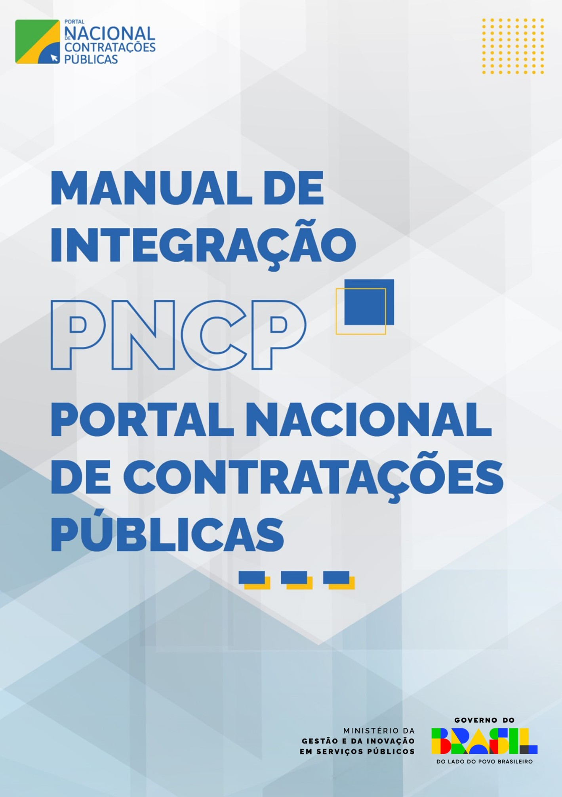

Manual de Integração do PNCP
===================================

\

.. note::

   Este documento contempla as orientações para realizar a integração de sistemas externos com as API REST do Portal Nacional de Contratações Públicas - PNCP.

Sumário
-------

.. toctree::
   :numbered:

   Histórico de Versões
   Objetivo
   Protocolo de Comunicação
   Acesso ao PNCP
   Recomendações Iniciais
   Tabelas de Domínio
   Serviços de Usuário
   Serviços de Órgão e Entidade
   Serviços de Contratação (Editais, Avisos e Atos) 
   Inserir Ata de Registro de Preço
   Inserir Contratos ou Empenhos
   Retificar Contrato ou Empenho 
   Excluir Contrato ou Empenho
   Inserir Documento a um Contrato ou Empenho
   Excluir Documento do Contrato ou Empenho
   Consultar Todos os Documentos de um Contrato ou Empenho
   Consultar Documento de um Contrato ou Empenho
   Consultar Todos os Documentos de um Termo de Contrato
   Consultar Todos os Termos de um Contrato
   Consultar Contrato ou Empenho
   Consultar Contratos ou Empenhos de uma Contratação
   Excluir Instrumento de Cobrança de Contrato ou Empenho
   Inserir Instrumento de Cobrança de um Contrato ou Empenho
   Retificar Parcialmente Instrumento de Cobrança de Contrato ou Empenho
   Serviço de Termo de Contrato
   Retificar Termo de Contrato
   Excluir Termo de Contrato
   Consultar um Termo de Contrato
   Inserir Documento a um Termo de Contrato
   Excluir Documento de um Termo de Contrato
   Consultar Documento de um Termo de Contrato
   Serviços de Plano de Contratações
   Excluir Plano de Contratações
   Consultar Plano por Órgão e Ano
   Consultar Plano das Unidades por Órgão e Ano
   Consultar Valores de Planos de Contratação de um Órgão por Categoria
