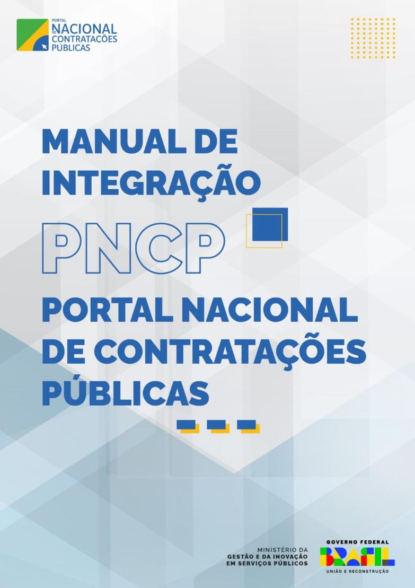

Manual de Integração do PNCP
===================================

#.

.. note::

   Este documento contempla as orientações para realizar a integração de sistemas externos com as API REST do PNCP (Portal Nacional de Contratações Públicas).

Sumário
--------

.. toctree::

   Histórico de Versões
   Objetivo
   Protocolo de Comunicação
   Acesso ao PNCP
